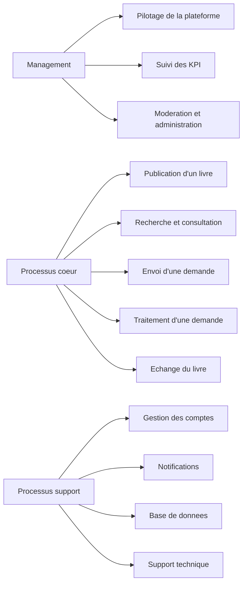
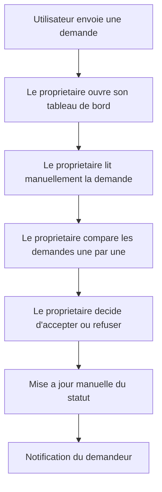
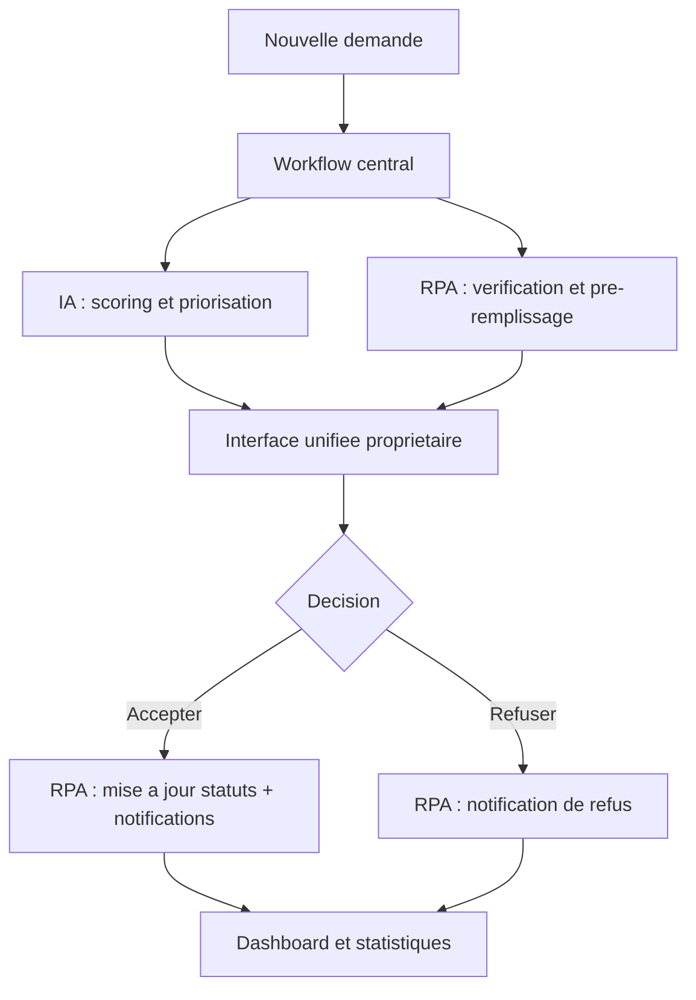
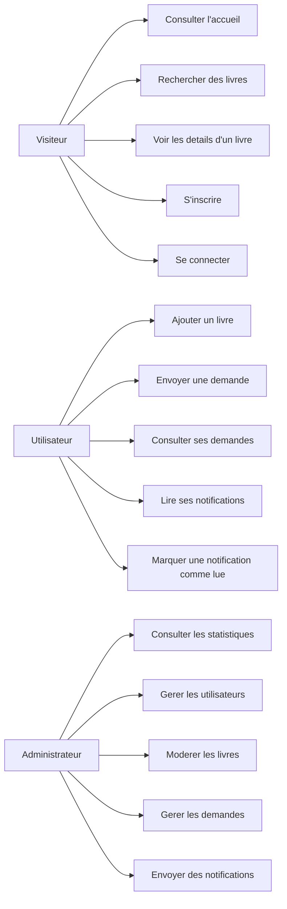
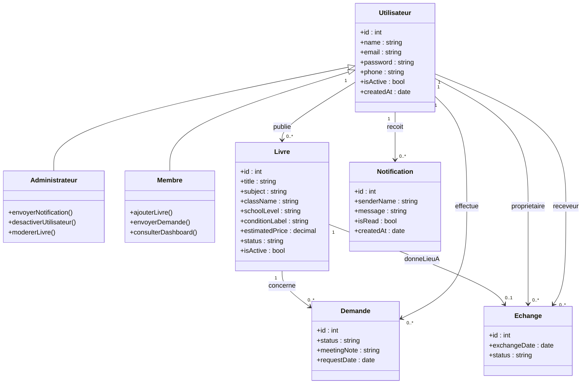
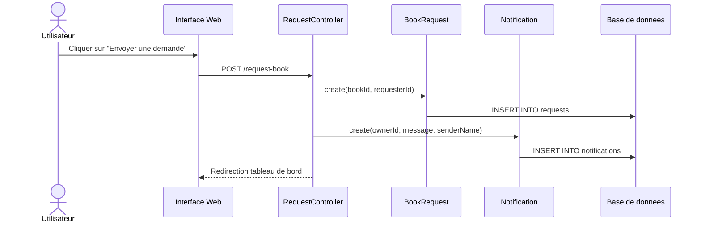
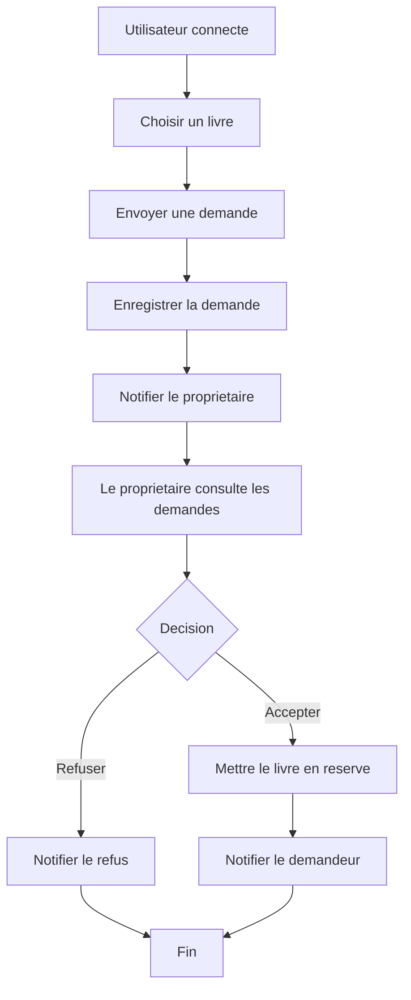

# Partie RPA Et AGL

Ce document complete le rapport principal du projet **BookCycle Tunisia** en couvrant :
- la partie reingenierie des processus d'affaires / RPA
- la partie atelier genie logiciel / AGL
- les diagrammes UML et les elements Scrum demandes dans l'enonce

---

## 1. Partie Reingenierie Des Processus D'Affaires

### 1.1 Entreprise Et Contexte

L'entreprise choisie est la plateforme **BookCycle Tunisia**, un systeme d'information social qui facilite la reutilisation des livres scolaires entre utilisateurs.  
Ce projet repond principalement a un objectif de developpement durable lie :
- a l'acces a l'education
- a la consommation responsable
- a la reduction des couts scolaires

### 1.2 Cartographie Des Processus Metiers

Les processus de l'entreprise peuvent etre classes en trois categories :

#### Processus coeur
- publication d'un livre
- recherche d'un livre
- envoi d'une demande
- traitement d'une demande
- concretisation d'un echange

#### Processus support
- gestion des comptes utilisateurs
- gestion des notifications
- gestion de la base de donnees
- supervision technique de la plateforme

#### Processus de management
- administration globale
- suivi des statistiques
- moderation des contenus
- pilotage de la performance

### 1.3 Diagramme De Cartographie Des Processus

### 1.4 Evaluation As-Is Des Processus

| Processus | SLA cible | KPI principal | Etat actuel As-Is |
|---|---|---|---|
| Publication d'un livre | moins de 3 min | temps moyen de publication | acceptable |
| Recherche d'un livre | moins de 10 sec | temps de recherche | acceptable |
| Envoi d'une demande | moins de 1 min | temps de creation de demande | acceptable |
| Traitement d'une demande | moins de 24 h | delai moyen de reponse | insuffisant |
| Notification utilisateur | moins de 5 sec | delai d'affichage de notification | moyen |
| Moderation admin | moins de 2 min par action | temps de traitement admin | moyen |

### 1.5 Processus Choisi Pour Le BPR

Le processus retenu pour la reingenierie est :
- **le traitement d'une demande de livre**

Ce choix est justifie par :
- son impact direct sur la satisfaction des utilisateurs
- la multiplicite des interventions manuelles
- le risque de lenteur, d'oubli ou d'incoherence dans les reponses
- son fort potentiel d'amelioration en delai et en qualite

### 1.6 Processus As-Is

### 1.7 Analyse SWOT As-Is

#### Forces
- processus simple a comprendre
- faible cout de mise en oeuvre initial
- facilite d'appropriation par les utilisateurs

#### Faiblesses
- traitement tres manuel
- delai de reponse variable
- risque d'oublier des demandes
- manque d'aide a la decision

#### Opportunites
- automatiser les taches repetitives
- introduire de l'intelligence artificielle pour prioriser les demandes
- offrir une meilleure experience utilisateur

#### Menaces
- resistance au changement
- dependance aux donnees disponibles
- erreurs de decision ou traitement incomplet

### 1.8 Methodologie De Refonte BPR

La methodologie retenue est une :
- **reingenierie progressive mais radicale**

Justification :
- il existe deja un processus fonctionnel qu'il faut garder compréhensible
- une approche Greenfield totale serait plus risquee pour un projet academique
- une refonte progressive permet d'introduire des briques modernes tout en gardant la coherence avec le systeme actuel

### 1.9 Solution Cible To-Be

La solution cible proposee integre obligatoirement :
- **IA** pour l'aide a la decision
- **RPA** pour les taches repetitives
- **workflow moderne** pour l'orchestration
- **interface unifiee** pour le proprietaire et l'administrateur

#### Role de l'IA

L'IA peut produire un score de priorite d'une demande selon :
- la rapidite de reponse
- l'historique des interactions
- la disponibilite du livre
- la coherence des informations du demandeur

#### Role du RPA

L'automatisation peut prendre en charge :
- la mise a jour automatique des statuts
- le rejet automatique des autres demandes si une demande est acceptee
- l'envoi de notifications
- la preparation de rapports statistiques

#### Role du workflow

Le workflow orchestre les etapes :
- reception de la demande
- priorisation
- validation
- notification
- mise a jour de la base

#### Interface unifiee

Une interface unifiee doit permettre :
- de voir les demandes prioritaires
- de voir les recommandations
- de lancer les actions sans changer d'ecran

### 1.10 Diagramme To-Be

### 1.11 Gain De Performance Attendu

La refonte vise un saut de performance d'au moins 50%.

| Critere | As-Is | To-Be | Gain estime |
|---|---|---|---|
| Temps moyen de traitement | 24 h | 6 h | 75% |
| Risque d'oubli de demande | eleve | faible | amelioration forte |
| Coherence des mises a jour | moyenne | elevee | amelioration forte |
| Satisfaction utilisateur | moyenne | elevee | amelioration forte |

### 1.12 Analyse SWOT To-Be

#### Forces
- processus plus rapide
- meilleure traçabilite
- meilleure aide a la decision
- automatisation des taches repetitives

#### Faiblesses
- besoin de donnees fiables
- besoin d'un minimum de configuration technique

#### Opportunites
- extension future vers un vrai moteur de recommandation
- exploitation de statistiques plus avancees
- meilleure qualite de service pour les utilisateurs

#### Menaces
- biais algorithmique dans le scoring
- dependance au workflow et a l'automatisation
- risque de mauvaise adoption si l'interface est mal expliquee

### 1.13 Comparaison As-Is / To-Be

Le passage de As-Is a To-Be permet :
- de transformer une faiblesse de lenteur en force de reactivite
- de transformer une faiblesse de gestion manuelle en opportunite d'automatisation
- de transformer l'absence d'aide a la decision en un processus plus intelligent

Les nouveaux risques introduits concernent principalement :
- la qualite des donnees
- la dependance aux regles automatiques
- l'acceptation du changement par les utilisateurs

---

## 2. Partie Atelier Genie Logiciel

### 2.1 Application Du Framework Scrum

Le projet est gere selon le cadre Scrum avec :
- un product backlog
- un sprint backlog
- un suivi done / doing / to do
- une demonstration finale

### 2.2 Product Backlog

| ID | Product backlog item | Priorite | Estimation |
|---|---|---|---|
| PB1 | En tant que visiteur, je veux consulter le catalogue des livres | Haute | 2 jours |
| PB2 | En tant qu'utilisateur, je veux creer un compte | Haute | 1 jour |
| PB3 | En tant qu'utilisateur, je veux me connecter | Haute | 1 jour |
| PB4 | En tant qu'utilisateur, je veux ajouter un livre | Haute | 2 jours |
| PB5 | En tant qu'utilisateur, je veux envoyer une demande sur un livre | Haute | 2 jours |
| PB6 | En tant que proprietaire, je veux accepter ou refuser une demande | Haute | 2 jours |
| PB7 | En tant qu'utilisateur, je veux voir mes notifications | Moyenne | 1 jour |
| PB8 | En tant qu'admin, je veux voir les statistiques globales | Haute | 2 jours |
| PB9 | En tant qu'admin, je veux gerer les utilisateurs | Haute | 2 jours |
| PB10 | En tant qu'admin, je veux moderer les livres | Haute | 2 jours |
| PB11 | En tant qu'admin, je veux gerer les demandes | Moyenne | 2 jours |
| PB12 | En tant qu'admin, je veux envoyer des notifications | Moyenne | 1 jour |

### 2.3 Sprint 1

#### Objectif du sprint

Mettre en place les fonctionnalites essentielles :
- architecture MVC
- connexion a la base
- inscription
- connexion
- affichage public du catalogue
- ajout de livre

#### Sprint backlog

| Element | Etat |
|---|---|
| Initialisation du projet MVC | done |
| Connexion PDO Oracle | done |
| Inscription | done |
| Connexion | done |
| Catalogue public | done |
| Ajout d'un livre | done |
| Gestion avancee des demandes | doing |
| Notifications | doing |
| Administration complete | to do au debut du sprint puis done dans la suite du projet |

### 2.4 Diagramme De Cas D'Utilisation

### 2.5 Diagramme De Classes

Ce diagramme respecte les contraintes de l'enonce :
- au moins cinq classes persistantes
- une association un a plusieurs
- une association plusieurs a plusieurs porteuse de donnees
- une generalisation

### 2.6 Justification De L'Association Plusieurs A Plusieurs Porteuse De Donnees

Conceptuellement, la relation entre :
- un utilisateur demandeur
- un livre

est une relation plusieurs a plusieurs.  
Cette relation est materialisee par la classe associative `Demande`, qui porte des donnees supplementaires :
- `status`
- `meetingNote`
- `requestDate`

Cette modélisation est conforme a l'exigence de l'enonce.

### 2.7 Diagramme De Sequence

Exemple : scenario d'envoi puis de traitement d'une demande

### 2.8 Diagramme D'Activite

### 2.9 Sprint Review Simulee

A la fin du sprint ou de la demonstration finale, il convient de presenter :
- les interfaces deja fonctionnelles
- les fonctionnalites done
- l'etat du sprint backlog
- les points a ameliorer

Fonctionnalites demonstrables dans BookCycle :
- page d'accueil
- inscription et connexion
- catalogue public
- ajout de livre
- envoi de demande
- traitement des demandes
- administration
- notifications

---

## 3. Conseils D'Insertion Dans Le Rapport Final

Vous pouvez inserer ce document dans le rapport principal :
- en ajoutant la section RPA avant la partie SGBD
- en ajoutant la section AGL avant ou apres la partie RPA
- en gardant les diagrammes Mermaid comme base

Si vous devez rendre le rapport en Word ou PDF, les diagrammes Mermaid peuvent etre :
- recopies dans un outil de diagramme
- exportes depuis un editeur compatible Mermaid
- ou transformes en images

---

## 4. Elements A Completer Manuellement

Avant la remise finale, il faudra encore personnaliser :
- les noms des etudiants
- le nom de l'encadrant
- les dates exactes des presentations intermediaires si elles vous ont ete communiquees
- les captures d'ecran
- toute partie RPA plus specifique si votre enseignant demande un outil ou un cas reel d'entreprise plus detaille

