# Diagrammes Projet Complets

Ce fichier regroupe des diagrammes Mermaid utiles pour comprendre et presenter **BookCycle Tunisia**.

## 1. Vue D'Ensemble De L'Architecture

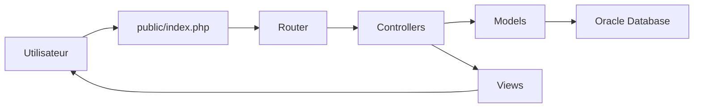

## 2. Structure MVC Du Projet

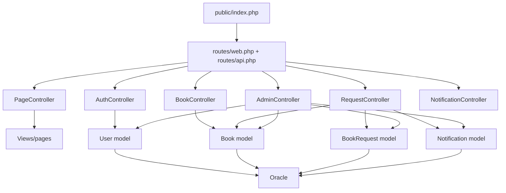

## 3. Diagramme Des Acteurs Et Fonctions

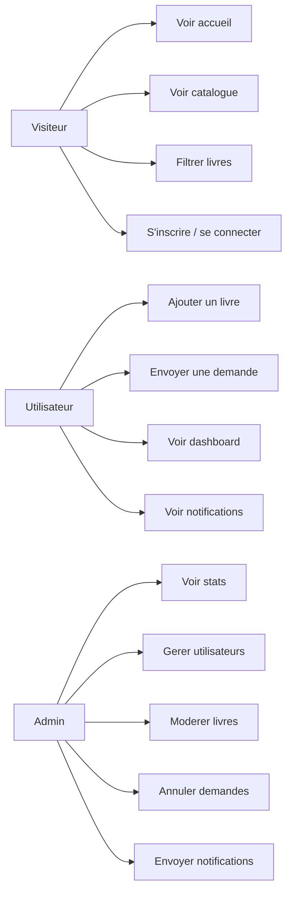

## 4. Diagramme Des Donnees

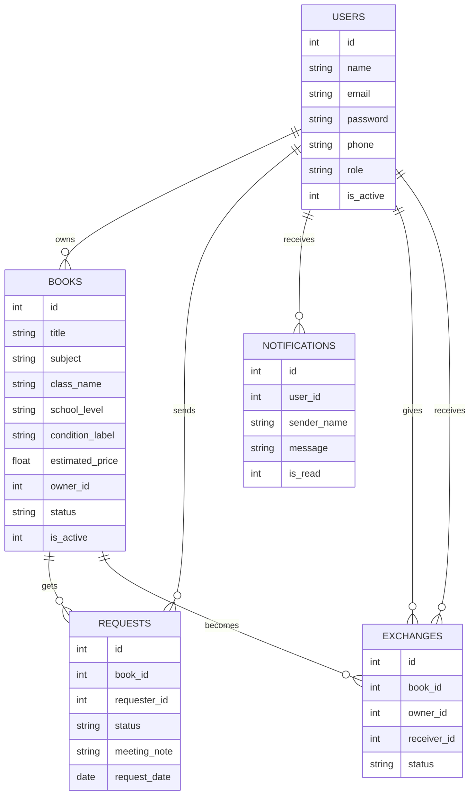

## 5. Demarrage D'Une Page

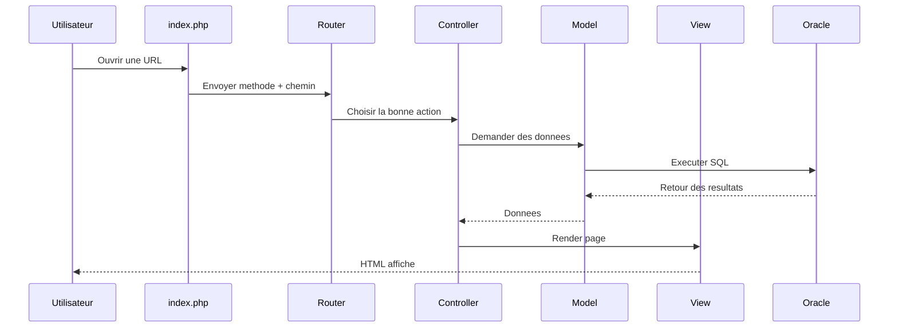

## 6. Inscription

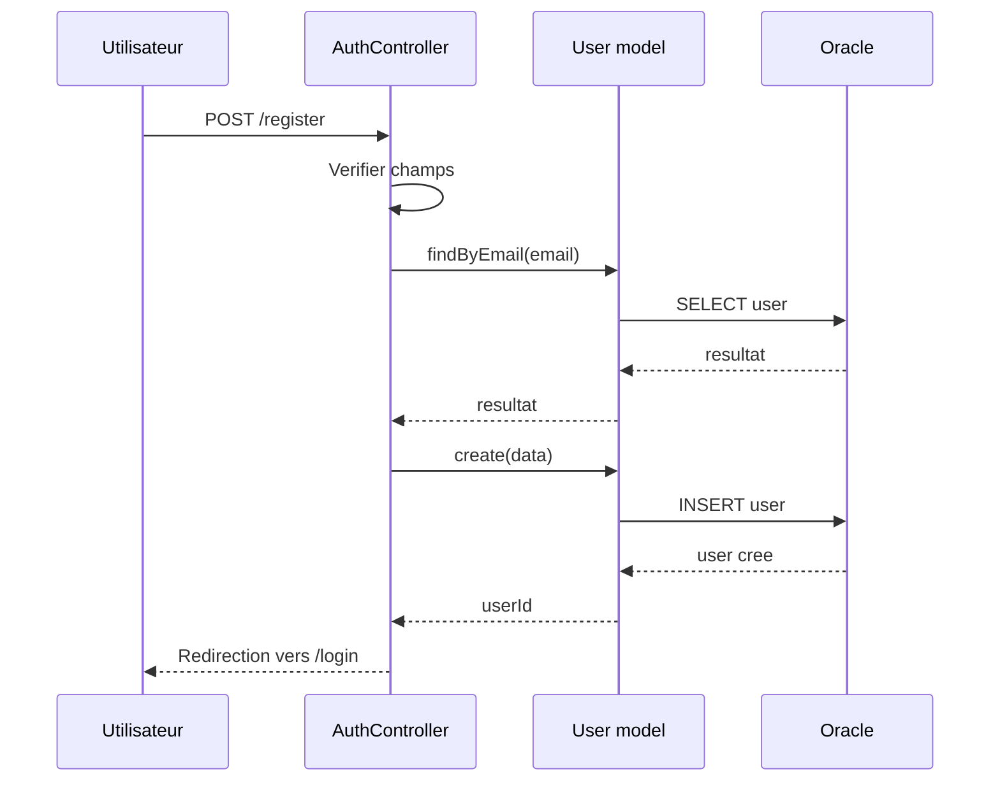

## 7. Connexion

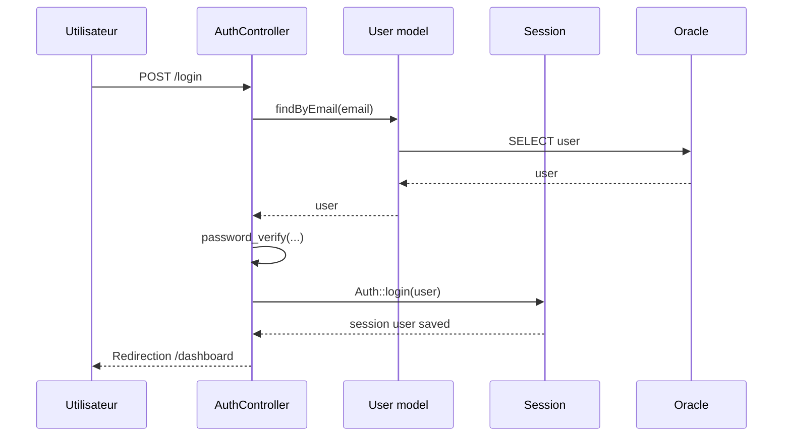

## 8. Ajout D'Un Livre

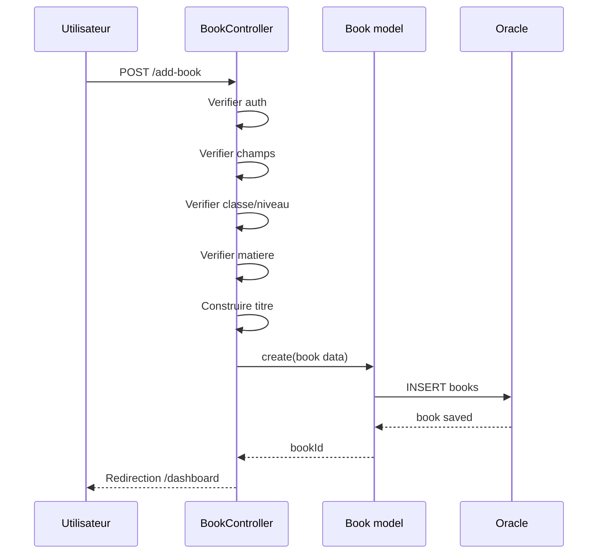

## 9. Consultation Du Catalogue

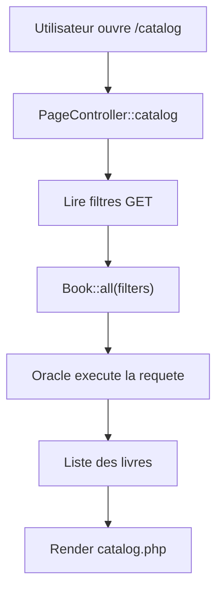

## 10. Envoi D'Une Demande

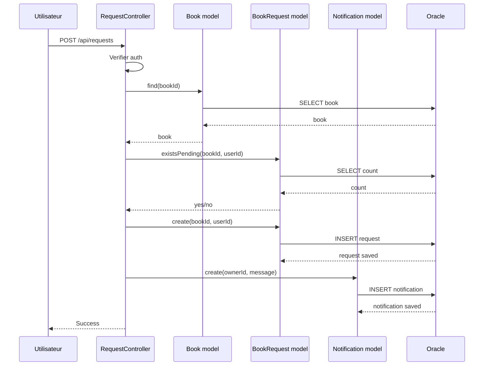

## 11. Acceptation D'Une Demande

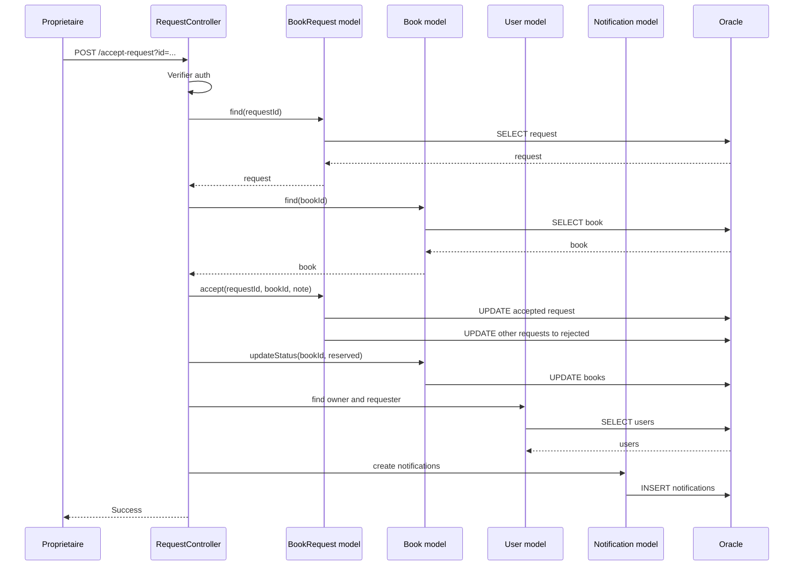

## 12. Rejet D'Une Demande

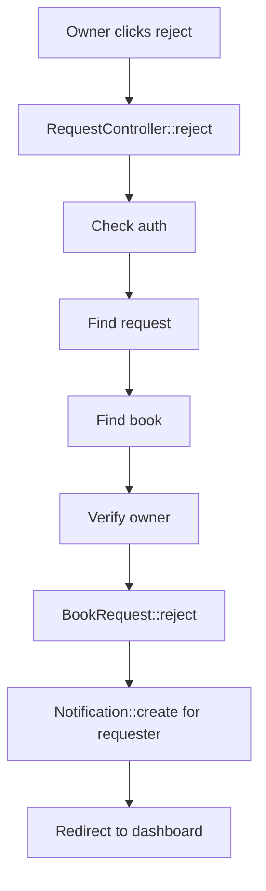

## 13. Notifications

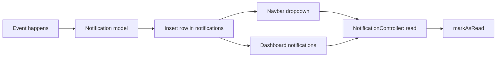

## 14. Tableau De Bord Admin

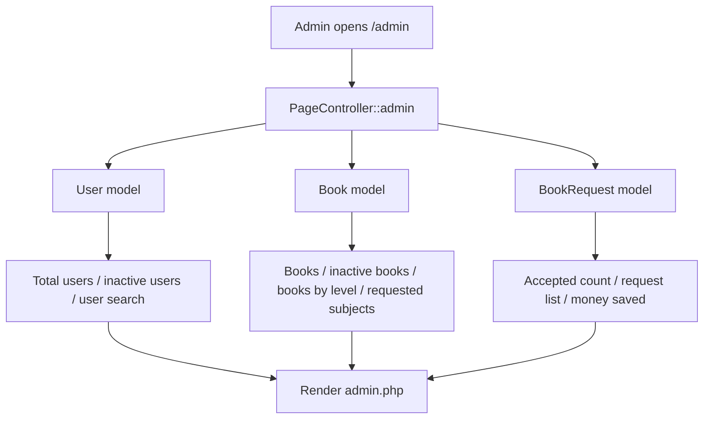

## 15. Diagramme De Classes Simplifie

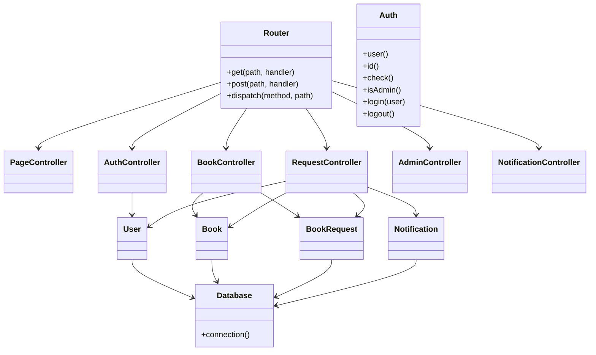

## 16. Cycle De Vie D'Un Livre

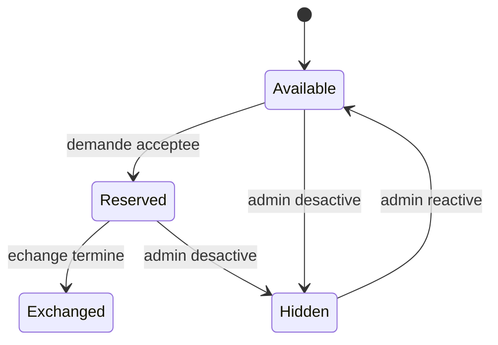

## 17. Cycle De Vie D'Une Demande

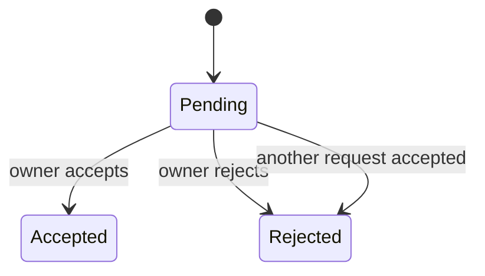

## 18. Carte Simple Des Dossiers

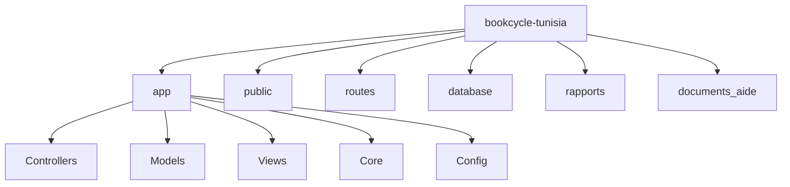
