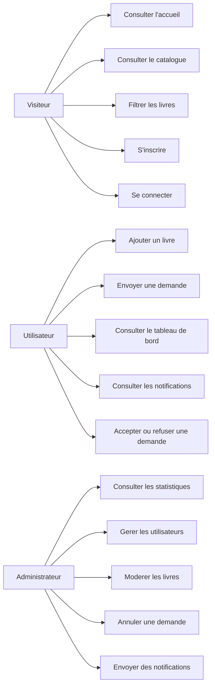
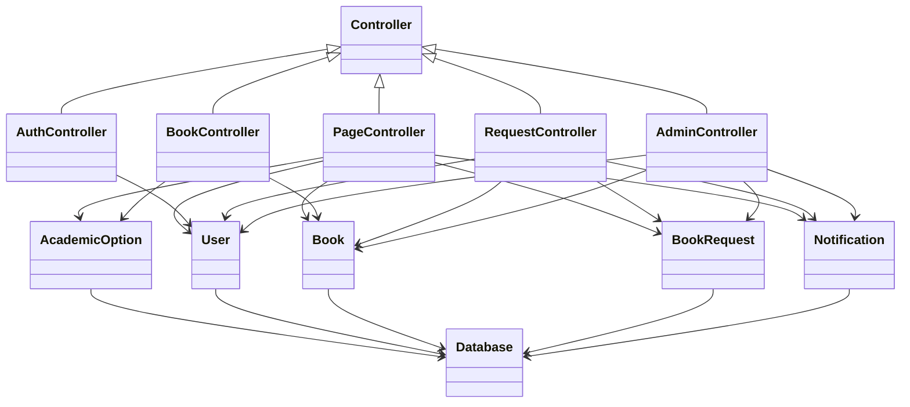
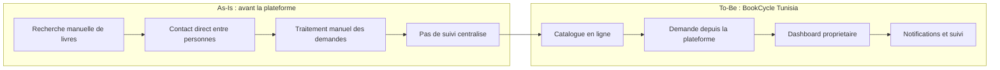
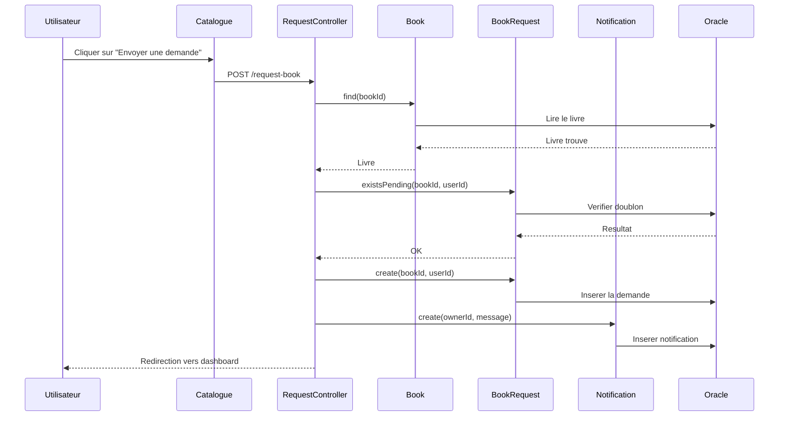
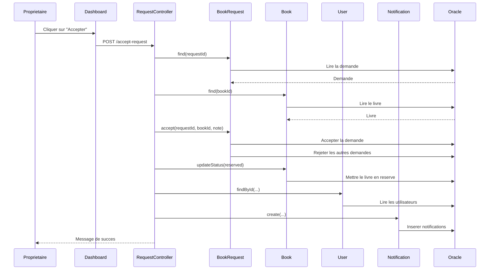
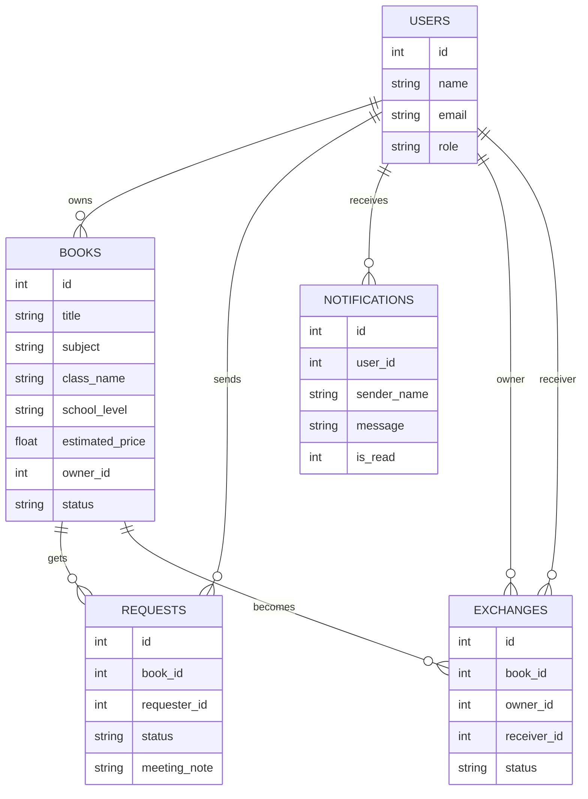

# Diagrammes Simplifies Pour La Soutenance

Ce fichier regroupe 6 diagrammes simples et propres a montrer au professeur.

## 1. Diagramme Des Cas D'utilisation

## 2. Diagramme De Classes De La Plateforme (To-Be)

## 3. Diagramme As-Is / To-Be

## 4. Diagramme De Sequence - Envoi D'une Demande

## 5. Diagramme De Sequence - Acceptation D'une Demande

## 6. Diagramme Entite-Relation

## Conseils De Presentation

- montre d'abord le diagramme des cas d'utilisation
- puis le diagramme de classes de la plateforme
- montre le diagramme `As-Is / To-Be` seulement si on te demande la partie BPR
- ensuite un seul diagramme de sequence si le temps est court
- termine par le diagramme entite-relation pour relier la partie web a la base
