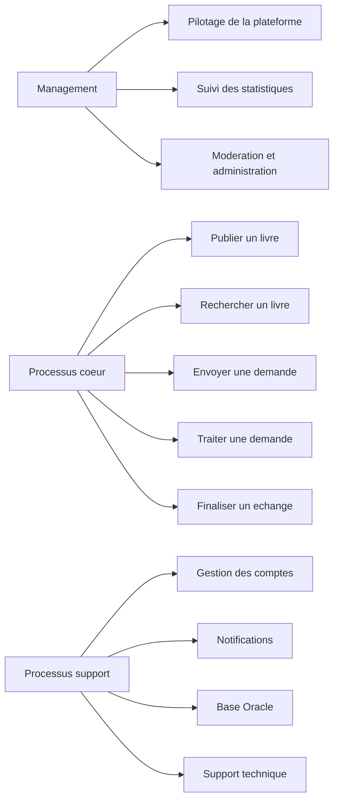
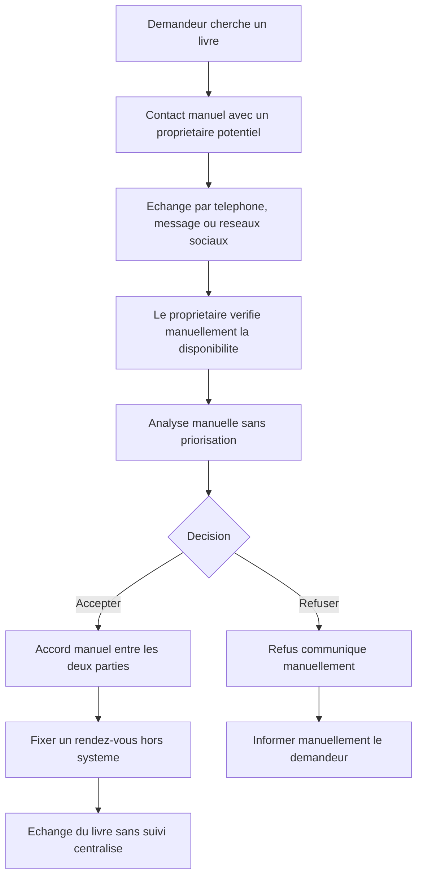
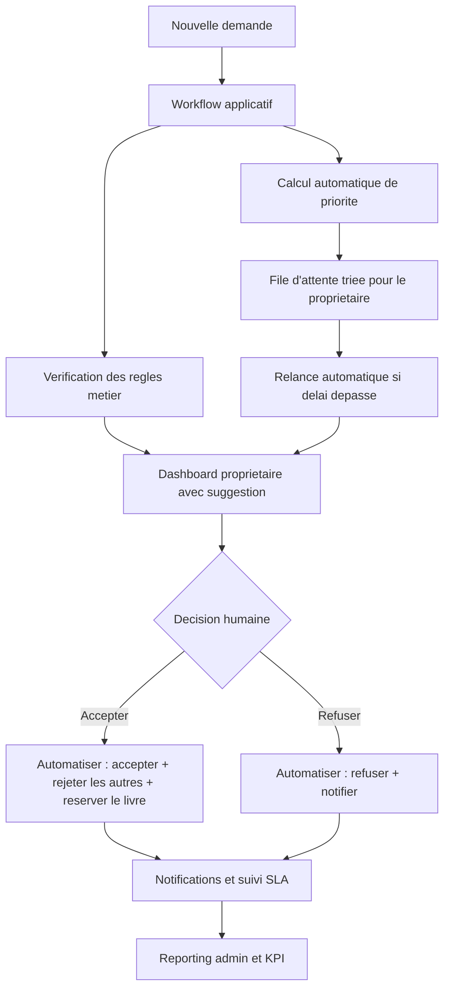
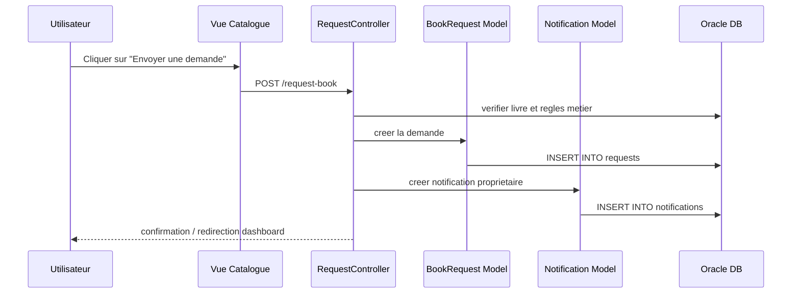
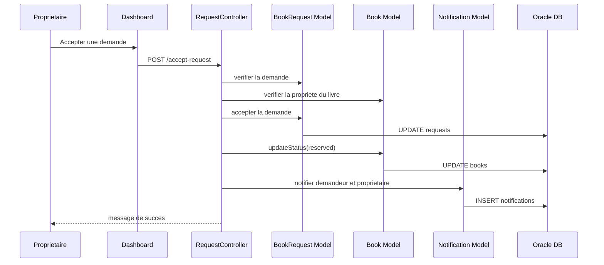

# Partie RPA Et AGL

Ce document complete le rapport principal du projet **BookCycle Tunisia**.  
Il couvre :
- la partie **RPA / reingenierie des processus d'affaires**
- la partie **AGL**
- les descriptions de diagrammes, backlog et elements d'organisation projet

---

## 1. Partie RPA - Reingenierie Des Processus D'Affaires

### 1.1 Organisation Et Contexte

Le projet **BookCycle Tunisia** peut etre assimile a une plateforme de service numerique a vocation sociale.  
Son objectif est de faciliter la circulation des livres scolaires entre utilisateurs afin de reduire les couts et le gaspillage.

Le systeme repond a plusieurs finalites :
- acces plus simple aux livres scolaires
- reduction des depenses pour les familles
- reutilisation des ressources existantes
- centralisation des interactions entre proprietaires et demandeurs

### 1.2 Cartographie Des Processus

Les processus metiers du projet peuvent etre classes en trois familles.

#### Processus coeur
- publication d'un livre
- consultation et filtrage du catalogue
- envoi d'une demande
- traitement d'une demande
- finalisation d'un echange

#### Processus support
- gestion des comptes
- authentification
- gestion des notifications
- gestion de la base de donnees Oracle
- maintenance de l'application

#### Processus de management
- administration de la plateforme
- suivi des statistiques
- moderation des livres
- supervision des demandes

### 1.3 Diagramme De Cartographie

### 1.4 Evaluation As-Is

L'etat actuel de la plateforme montre que le processus le plus sensible reste le traitement des demandes.

| Processus | SLA cible | KPI principal | Evaluation As-Is |
|---|---|---|---|
| Publication d'un livre | moins de 3 min | temps de publication | satisfaisant |
| Recherche d'un livre | moins de 10 sec | temps de reponse catalogue | satisfaisant |
| Envoi d'une demande | moins de 1 min | temps de creation | satisfaisant |
| Traitement d'une demande | moins de 24 h | delai de reponse proprietaire | moyen |
| Notification | moins de 5 sec | delai de notification | correct |
| Moderation admin | moins de 2 min | temps d'action admin | correct |

### 1.5 Processus Choisi Pour Le BPR

Le processus choisi pour la reingenierie est :
- **le traitement d'une demande de livre**

Ce choix est justifie par :
- son importance dans la satisfaction utilisateur
- la presence d'actions repetitives
- la possibilite d'automatiser certaines decisions et notifications
- son impact direct sur la qualite globale du service

### 1.6 Processus As-Is

Ici, **As-Is** designe la situation avant l'existence de la plateforme BookCycle Tunisia.

### 1.7 Analyse SWOT As-Is

#### Forces
- processus facile a comprendre
- peu de dependance technique
- logique metier centralisee

#### Faiblesses
- dependance a l'action manuelle du proprietaire
- delai variable de reponse
- manque de priorisation des demandes

#### Opportunites
- automatisation de notifications
- aide a la decision
- exploitation des statistiques historiques

#### Menaces
- retard de traitement
- risque d'oublier une demande
- experience utilisateur inegale

### 1.8 Methodologie BPR Retenue

La methodologie retenue est une :
- **refonte progressive avec forte automatisation ciblee**

Cette approche est adaptee car :
- le processus existe deja a l'etat manuel
- il faut l'ameliorer sans casser la simplicite du service
- un projet academique doit rester maitrisable

### 1.9 Solution To-Be

La solution cible proposee combine :
- **workflow**
- **RPA**
- **aide a la decision**

#### Ce qui reste humain
- validation finale d'acceptation ou de refus
- choix du contact et du rendez-vous
- moderation complexe

#### Ce qui peut etre automatise
- tri des demandes par priorite
- relance des demandes en attente
- notification automatique apres chaque changement d'etat
- preparation des statistiques admin
- suggestion de la meilleure demande a traiter

### 1.10 Diagramme To-Be

Ici, **To-Be** designe la solution cible : la plateforme BookCycle Tunisia.

### 1.11 Gains Attendus

| Critere | As-Is | To-Be | Gain estime |
|---|---|---|---|
| Temps de traitement | 24 h | 6 h | 75% |
| Oubli de demande | moyen | faible | amelioration forte |
| Qualite du suivi | correcte | elevee | amelioration nette |
| Satisfaction utilisateur | moyenne | elevee | amelioration forte |

### 1.12 Scenarios D'Automatisation RPA

Les scenarios RPA proposes pour le projet sont :

#### Scenario 1 : relance automatique
- detecter les demandes `pending` depuis plus de 48 heures
- notifier le proprietaire
- remonter ces demandes dans le dashboard

#### Scenario 2 : cloture automatique
- lorsqu'une demande est acceptee, rejeter automatiquement les autres demandes `pending` du meme livre
- notifier chaque demandeur concerne

#### Scenario 3 : reporting automatique
- generer un resume des KPI admin
- mettre en avant les matieres les plus demandees
- suivre les livres inactifs ou comptes inactifs

### 1.13 KPI Cibles

Les indicateurs les plus pertinents sont :
- nombre total de livres actifs
- nombre total d'echanges
- economie totale estimee
- matieres les plus demandees
- taux de demandes acceptees
- delai moyen de reponse proprietaire

### 1.14 Conclusion RPA

L'analyse montre que **BookCycle Tunisia** est deja structure autour d'un flux clair, mais que le traitement des demandes peut etre davantage automatise.  
La partie RPA ne remplace pas la decision metier, elle l'assiste par :
- des relances
- des mises a jour automatiques
- une meilleure visibilite des priorites

---

## 2. Partie AGL

### 2.1 Demarche De Genie Logiciel

Le projet suit une logique de developpement incremental :
- analyse du besoin
- modelisation
- implementation du schema Oracle
- developpement MVC
- enrichissement iteratif des fonctionnalites
- tests et corrections

### 2.2 Choix D'Organisation

L'organisation du projet peut etre assimilee a une gestion de type **Scrum simplifiee** avec :
- un product backlog
- une planification par blocs fonctionnels
- des livraisons iteratives

### 2.3 Product Backlog

| ID | User story | Priorite | Estimation |
|---|---|---|---|
| PB1 | En tant que visiteur, je veux consulter le catalogue | Haute | 2 jours |
| PB2 | En tant qu'utilisateur, je veux m'inscrire | Haute | 1 jour |
| PB3 | En tant qu'utilisateur, je veux me connecter | Haute | 1 jour |
| PB4 | En tant qu'utilisateur, je veux ajouter un livre | Haute | 2 jours |
| PB5 | En tant qu'utilisateur, je veux envoyer une demande | Haute | 2 jours |
| PB6 | En tant que proprietaire, je veux accepter ou refuser une demande | Haute | 2 jours |
| PB7 | En tant qu'utilisateur, je veux voir mes notifications | Moyenne | 1 jour |
| PB8 | En tant qu'admin, je veux consulter les statistiques | Haute | 2 jours |
| PB9 | En tant qu'admin, je veux gerer les utilisateurs | Haute | 2 jours |
| PB10 | En tant qu'admin, je veux moderer les livres | Haute | 2 jours |
| PB11 | En tant qu'admin, je veux filtrer les demandes | Moyenne | 1 jour |
| PB12 | En tant qu'admin, je veux envoyer des notifications | Moyenne | 1 jour |
| PB13 | En tant que visiteur, je veux voir les pages About, Contact et Privacy Policy | Moyenne | 1 jour |
| PB14 | En tant qu'utilisateur, je veux choisir la matiere depuis une liste | Haute | 1 jour |
| PB15 | En tant que visiteur, je veux filtrer aussi par classe | Haute | 1 jour |

### 2.4 Proposition De Sprint Planning

#### Sprint 1 : socle technique
- schema Oracle
- architecture MVC
- auth utilisateur
- page d'accueil

#### Sprint 2 : coeur metier
- ajout de livre
- catalogue
- detail livre
- demandes
- notifications

#### Sprint 3 : administration et finalisation
- dashboard admin
- statistiques
- moderation
- pages publiques
- filtres avances

### 2.5 Definition Of Done

Une fonctionnalite est consideree terminee si :
- la logique metier est implemente
- l'action web est accessible
- la vue fonctionne
- les entrees sont validees
- le rendu ne casse pas les autres pages
- le comportement a ete teste manuellement

---

## 3. Diagrammes UML Et Descriptions

### 3.1 Diagramme De Cas D'Utilisation - Description Textuelle

#### Acteur : Visiteur
- consulter l'accueil
- consulter le catalogue
- filtrer les livres
- consulter les pages d'information
- s'inscrire
- se connecter

#### Acteur : Utilisateur
- publier un livre
- voir son tableau de bord
- envoyer une demande
- consulter les notifications
- accepter ou refuser une demande recue

#### Acteur : Administrateur
- consulter l'administration
- gerer les utilisateurs
- moderer les livres
- gerer les demandes
- envoyer des notifications

### 3.2 Diagramme De Classes - Description Textuelle

#### Classe `User`
Attributs :
- id
- name
- email
- password
- phone
- role
- is_active
- created_at

#### Classe `Book`
Attributs :
- id
- title
- subject
- class_name
- school_level
- condition_label
- estimated_price
- description
- owner_id
- status
- is_active

#### Classe `BookRequest`
Attributs :
- id
- book_id
- requester_id
- status
- meeting_note
- request_date

#### Classe `Notification`
Attributs :
- id
- user_id
- sender_name
- message
- is_read
- created_at

#### Classe `Exchange`
Attributs :
- id
- book_id
- owner_id
- receiver_id
- exchange_date
- status

### 3.3 Diagramme De Sequence - Envoi D'Une Demande

### 3.4 Diagramme De Sequence - Acceptation D'Une Demande

---

## 4. Cohabitation Entre AGL, Web Et SGBD

Le projet illustre bien la complementarite entre modules :

- **AGL** : analyse, acteurs, cas d'utilisation, backlog, architecture
- **SGBD** : schema Oracle, contraintes, vue, index, PL/SQL
- **Programmation Web 2** : MVC, point d'entree unique, pages, formulaires, controleurs et validation
- **RPA** : reingenierie et automatisation ciblee des processus

Les evolutions recentes du projet confirment cette integration :
- ajout des pages publiques dans l'application web
- enrichissement du catalogue avec filtres structures
- validation forte de la matiere et de la classe
- chargement des matieres et classes depuis Oracle via `subjects`, `school_classes` et `class_subjects`
- mise en coherence entre front, controleurs et modele Oracle

---

## 5. Recommandations Pour La Version Finale

Pour une remise finale plus solide, il est recommande d'ajouter :
- captures d'ecran des principales pages
- vrais diagrammes UML exportes depuis un outil
- captures SQL Developer montrant les objets Oracle
- tableau des tests manuels
- eventuelle maquette du processus To-Be pour la partie RPA

---

## 6. Conclusion

Ce document RPA/AGL montre que le projet **BookCycle Tunisia** ne se limite pas a une application web.  
Il s'agit d'une solution complete appuyee sur :
- une analyse des besoins
- un schema relationnel Oracle
- des objets PL/SQL
- une architecture MVC
- une reflexion de reingenierie des processus

La plateforme est deja fonctionnelle dans sa version Oracle et peut encore evoluer vers une automatisation plus poussee du traitement des demandes et du reporting.
