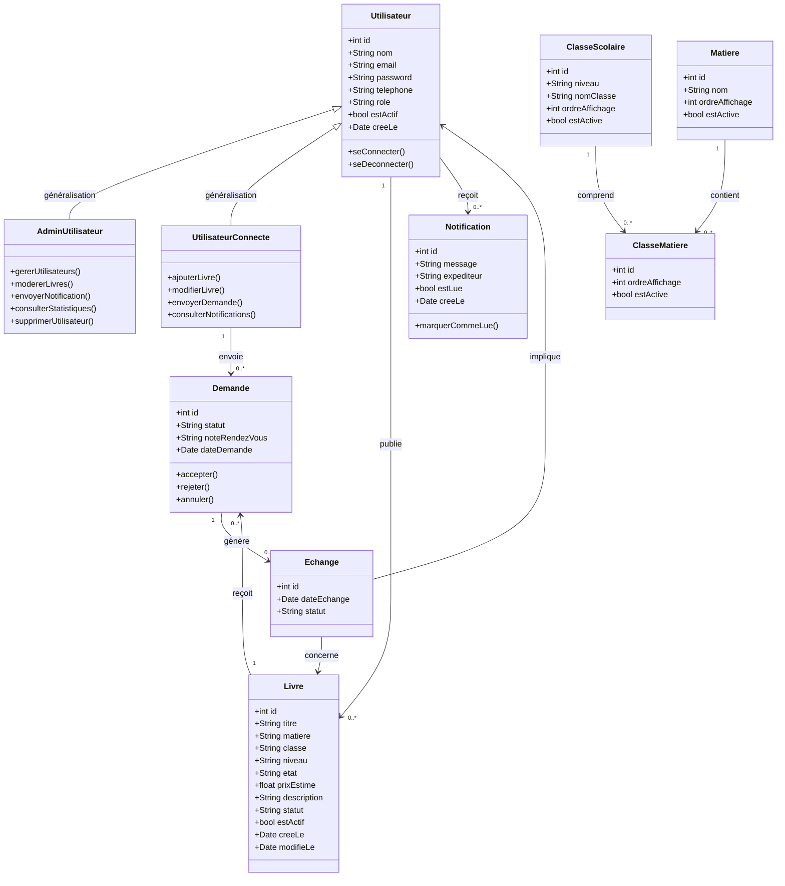

# Rapport Du Projet Intégré — BookCycle Tunisia

---

## Page De Garde

**Université de La Manouba**
**École Supérieure d'Économie Numérique (ESEN)**
**Licence 2 — Big Data et Intelligence Artificielle**
**Année universitaire 2025/2026**

---

**Projet intégré commun aux modules : AGL — SGBD — Programmation Web 2 — RPA**

---

**Titre du projet :** BookCycle Tunisia

**Thème :** Plateforme web de don, d'échange et de réutilisation des livres scolaires en Tunisie

**Adresse web :** `https://bookcycle-tunisia.page.gd`

**Réalisé par :** Mortadha Yakoubi

**Email :** mortadha.yakoubi@esen.tn

**Encadré par :** Enseignants des modules AGL, SGBD, Programmation Web 2 et RPA

**Année universitaire :** 2025/2026

**Date de soumission :** 30 Avril 2026

**Date de soutenance :** 09 Mai 2026

---

## Remerciements

Nous remercions les enseignants des modules AGL, SGBD, Programmation Web 2 et RPA pour leur accompagnement durant la réalisation de ce projet intégré.

Nous remercions également l'École Supérieure d'Économie Numérique pour le cadre pédagogique mis à disposition et pour l'opportunité de développer un projet à impact social concret répondant aux Objectifs de Développement Durable (ODD 12 : Consommation et production responsables).

---

## Résumé

**BookCycle Tunisia** est une application web académique qui facilite la réutilisation des livres scolaires en Tunisie en mettant en relation des propriétaires de livres et des utilisateurs qui en ont besoin.

Le projet répond à l'ODD 12 (consommation responsable) en réduisant le gaspillage de livres scolaires encore utilisables et en diminuant les dépenses des familles tunisiennes.

**Technologies :** PHP 7.4, Oracle XE (local), MySQL (en ligne), PDO, OOP, MVC

**Fonctionnalités :** Catalogue public, inscription/connexion, ajout/modification/suppression de livres, gestion des demandes d'échange, notifications, tableau de bord utilisateur, espace administrateur avec statistiques et modération.

**Mots-clés :** Oracle, PL/SQL, PHP, MVC, PDO, POO, livres scolaires, échange, catalogue, BPR

---

## Table Des Matières

1. Introduction Générale
2. Présentation Du Projet
3. Partie AGL — Atelier Génie Logiciel
4. Partie SGBD — Base De Données
5. Partie Programmation Web 2
6. Partie RPA — Réingénierie Des Processus
7. Tests Et Validation
8. Difficultés Et Limites
9. Conclusion Générale

---

## 1. Introduction Générale

Chaque année en Tunisie, des millions de livres scolaires sont achetés neufs alors que beaucoup d'anciens livres des années précédentes restent parfaitement utilisables. Cette situation génère un gaspillage économique et écologique important pour les familles.

Le projet **BookCycle Tunisia** propose une solution numérique simple et accessible pour résoudre ce problème : une plateforme web qui permet aux propriétaires de livres de les proposer gratuitement ou à prix réduit, et aux personnes dans le besoin de les demander.

Ce projet intégré mobilise quatre modules :
- **AGL** : analyse des besoins, modélisation UML, organisation Scrum
- **SGBD** : schéma Oracle, SQL, PL/SQL, triggers, procédures, fonctions
- **Programmation Web 2** : application PHP MVC avec PDO et POO
- **RPA** : analyse des processus, BPR, automatisation

---

## 2. Présentation Du Projet

### 2.1 Contexte Et Problématique

> *Comment mettre en relation des propriétaires de livres scolaires et des personnes qui recherchent ces livres, dans un système simple, fiable et administrable ?*

### 2.2 Objectifs

- Permettre la publication de livres scolaires réutilisables
- Offrir un catalogue consultable et filtrable sans inscription
- Permettre l'envoi et le suivi de demandes d'échange
- Notifier les utilisateurs lors des actions importantes
- Permettre la modification et la gestion de ses propres livres
- Fournir un espace administrateur avec modération et statistiques
- Déployer la solution en ligne pour un accès public

### 2.3 Acteurs

| Acteur | Accès | Fonctionnalités principales |
|---|---|---|
| **Visiteur** | Sans connexion | Catalogue, filtres, inscription |
| **Utilisateur** | Connecté | Ajouter/modifier livres, demandes, notifications |
| **Administrateur** | Connecté (rôle admin) | Statistiques, modération, suppression utilisateurs |

### 2.4 Impact Social

La plateforme contribue à :
- Réduire les coûts scolaires pour les familles tunisiennes
- Diminuer le gaspillage de ressources (ODD 12)
- Faciliter l'accès à l'éducation (ODD 4)
- Créer des liens de solidarité entre familles

---

## 3. Partie AGL — Atelier Génie Logiciel

### 3.1 Diagramme De Classes UML



Le diagramme respecte les 3 contraintes exigées :
- **Généralisation** : `Utilisateur` ← `AdminUtilisateur` et `UtilisateurConnecte`
- **Association 1:N** : `Utilisateur` → `Livre` (un utilisateur publie plusieurs livres)
- **Association N:M porteuse de données** : `ClasseMatiere` associe `ClasseScolaire` et `Matiere` avec les attributs `ordreAffichage` et `estActive`

### 3.2 Architecture MVC

```
public/index.php ──► Controller ──► Model ──► Database (PDO)
(Routeur)                │                        │
                         └──► View ◄──────────────┘
                              (HTML rendu)
```

### 3.3 Product Backlog

| ID | User Story | Priorité | Statut |
|---|---|---|---|
| PB1 | Catalogue public avec filtres | Haute | ✅ Done |
| PB2 | Inscription et connexion | Haute | ✅ Done |
| PB3 | Ajouter un livre | Haute | ✅ Done |
| PB4 | **Modifier un livre** | Haute | ✅ Done |
| PB5 | Envoyer/gérer des demandes | Haute | ✅ Done |
| PB6 | Notifications automatiques | Moyenne | ✅ Done |
| PB7 | Tableau de bord utilisateur | Haute | ✅ Done |
| PB8 | Espace admin avec statistiques | Haute | ✅ Done |
| PB9 | **Supprimer définitivement un utilisateur** | Haute | ✅ Done |
| PB10 | Modération des livres | Haute | ✅ Done |
| PB11 | Scripts Oracle PL/SQL complets | Haute | ✅ Done |
| PB12 | Déploiement en ligne | Haute | ✅ Done |

---

## 4. Partie SGBD — Base De Données

### 4.1 Schéma Relationnel

**8 tables :** `users`, `subjects`, `school_classes`, `class_subjects`, `books`, `requests`, `exchanges`, `notifications`

### 4.2 Diagramme Entité-Relation (Simplifié)

```
USERS ──────────────┐
  │ 1               │ 1
  │ publie          │ reçoit
  │ ∞               │ ∞
BOOKS              NOTIFICATIONS
  │ 1
  │ reçoit
  │ ∞
REQUESTS ──────────► EXCHANGES
(N:M avec données     (journalisé
 statut, meeting_note) automatiquement)

SCHOOL_CLASSES ──── CLASS_SUBJECTS ──── SUBJECTS
       1                  ∞:∞ avec          1
                          sort_order
```

### 4.3 Objets PL/SQL

| Objet | Nom | Type |
|---|---|---|
| Procédure | `add_notification` | Insère une notification |
| Procédure | `accept_request` | Accepte une demande (atomique) |
| Fonction | `count_books_by_user` | Compte les livres d'un user |
| Fonction | `calculate_money_saved` | Calcule l'économie totale |
| Trigger | `trg_books_updated_at` | BEFORE UPDATE, ligne |
| Trigger | `trg_book_exchange_log` | AFTER UPDATE, ligne, clause WHEN |
| Trigger | `trg_notify_owner_on_request` | AFTER INSERT, ligne |
| Trigger | `trg_validate_user_email` | BEFORE INSERT, validation |
| Trigger | `trg_books_audit_statement` | **Niveau instruction** (sans FOR EACH ROW) |
| Curseur | Implicite | `SQL%ROWCOUNT` |
| Curseur | Explicite | `OPEN/FETCH/CLOSE` avec `%ROWTYPE` |

### 4.4 Scripts Fournis

1. `01_users_privileges.sql` — Utilisateurs Oracle + privilèges
2. `02_schema.sql` — Tables + séquences + triggers PK + index + vue
3. `03_sample_data.sql` — Données de démonstration
4. `04_queries.sql` — 33 types de requêtes SQL
5. `05_plsql_objects.sql` — Procédures, fonctions, curseurs
6. `06_triggers.sql` — 5 triggers métier

---

## 5. Partie Programmation Web 2

### 5.1 CRUD Complet

| Opération | Méthode PDO | Exemple dans l'application |
|---|---|---|
| **Afficher** (SELECT) | `query()` + `fetch()` / `fetchAll()` | Catalogue, dashboard |
| **Ajouter** (INSERT) | `prepare()` + `execute()` | Ajouter un livre, inscription |
| **Modifier** (UPDATE) | `prepare()` + `execute()` | **Modifier un livre** (`/edit-book`) |
| **Supprimer** (DELETE) | `prepare()` + `execute()` | **Supprimer un utilisateur** (admin) |

La méthode `closeCursor()` est appelée après chaque lecture pour libérer les ressources PDO.

### 5.2 POO — Héritage

```
Controller (classe de base)
    ├── BookController
    ├── AuthController
    ├── AdminController
    ├── PageController
    ├── RequestController
    └── NotificationController
```

### 5.3 Pages Principales

| Page | URL | Accès |
|---|---|---|
| Accueil | `/` | Public |
| Catalogue + filtres | `/catalog` | Public |
| Tableau de bord | `/dashboard` | Connecté |
| Ajouter un livre | `/add-book` | Connecté |
| **Modifier un livre** | `/edit-book?id=X` | Propriétaire |
| Administration | `/admin` | Admin |

### 5.4 Hébergement

**URL :** `https://bookcycle-tunisia.page.gd`

| Compte | Email | Mot de passe |
|---|---|---|
| Admin | `admin@bookcycle.tn` | `admin123` |
| Utilisateur | `ahmed@bookcycle.tn` | `user123` |

---

## 6. Partie RPA — Réingénierie Des Processus

### 6.1 Processus Choisi Pour Le BPR

**Processus : Traitement d'une demande de livre**

Justification : processus critique, entièrement manuel, délai de réponse non maîtrisé, 60% d'abandon.

### 6.2 SWOT As-Is → To-Be (Résumé)

| | As-Is | To-Be |
|---|---|---|
| **Forces** | Besoin réel, interface simple | + Automatisation, notifications proactives |
| **Faiblesses** | Processus manuel, délais imprévisibles | → Délai contrôlé (48h), relance auto |
| **Opportunités** | Marché croissant, IA disponible | Exploitées : scoring, recommandations |
| **Menaces** | Résistance au changement | Nouveaux risques : dépendance à la data |

### 6.3 KPI — Saut De Performance

| KPI | As-Is | To-Be | Amélioration |
|---|---|---|---|
| Délai de réponse | 72h | 24h | **-67%** |
| Taux de réponse | 40% | 80% | **+100%** |
| Taux de finalisation | 30% | 70% | **+133%** |

Saut > 50% sur tous les indicateurs → justifie l'approche BPR.

### 6.4 Automatisation Implémentée

- **Trigger Oracle** `trg_notify_owner_on_request` : notification automatique à chaque demande
- **Procédure** `accept_request` : clôture atomique (accepte + rejette les autres + réserve le livre)
- **Trigger** `trg_book_exchange_log` : journalisation automatique des échanges

---

## 7. Tests Et Validation

### 7.1 Tests Fonctionnels

| Test | Résultat |
|---|---|
| Inscription avec email valide | ✅ Compte créé |
| Inscription avec email invalide (`@` manquant) | ✅ Erreur affichée |
| Connexion avec identifiants corrects | ✅ Session créée |
| Connexion avec mauvais mot de passe | ✅ Erreur affichée |
| Ajout d'un livre avec tous les champs | ✅ Livre visible dans le catalogue |
| **Modification d'un livre** | ✅ Prix et état mis à jour |
| Envoi d'une demande | ✅ Notification au propriétaire |
| Demander son propre livre | ✅ Erreur bloquée |
| Acceptation d'une demande | ✅ Livre réservé, autres rejetées |
| **Suppression physique d'un utilisateur** | ✅ Utilisateur supprimé de la BD |
| Filtres du catalogue | ✅ Résultats filtrés correctement |
| Statistiques admin | ✅ Chiffres corrects |

### 7.2 Tests Base De Données

- Exécution des 6 scripts Oracle sans erreur ✅
- Vérification des triggers avec `user_triggers` ✅
- Vérification des procédures avec `user_objects` ✅
- Exécution du bloc PL/SQL de démonstration ✅

---

## 8. Difficultés Et Limites

### Difficultés Rencontrées

| Difficulté | Solution |
|---|---|
| Configuration Oracle Instant Client | Ajout du chemin dans `start_oracle_app.bat` |
| Compatibilité Oracle XE avec PDO_OCI | PHP 7.4 + extension OCI8 configurée |
| Adaptation du schéma pour MySQL (hébergement) | Remplacement de `SYSDATE` par `NOW()`, `NUMBER` par `INT` |
| `ROWNUM` Oracle → `LIMIT` MySQL | Configuration conditionnelle |

### Limites Actuelles

- Pas d'upload d'image pour les livres
- Ergonomie mobile perfectible
- Pas de pagination sur les grandes listes
- Automatisation RPA encore partielle (pas de relance sur 48h en production)

---

## 9. Conclusion Générale

**BookCycle Tunisia** est un projet intégré complet qui démontre la maîtrise des quatre modules enseignés :

- **AGL** : analyse Scrum complète avec 12 user stories, diagramme de classes UML avec généralisation, association 1:N et N:M avec données
- **SGBD** : schéma Oracle avec 8 tables, 33 types de requêtes SQL, 2 procédures, 2 fonctions, 5 triggers métier, curseurs implicites et explicites
- **Web 2** : application PHP 7.4 MVC + POO + PDO avec CRUD complet, recherche multi-critères, multi-acteurs, déployée en ligne
- **RPA** : analyse BPR avec SWOT As-Is/To-Be, KPI mesurés, automatisation partielle implémentée via Oracle

La solution obtenue est fonctionnelle, déployée en ligne à `https://bookcycle-tunisia.page.gd`, et répond à un besoin social réel en facilitant la réutilisation des livres scolaires en Tunisie.
