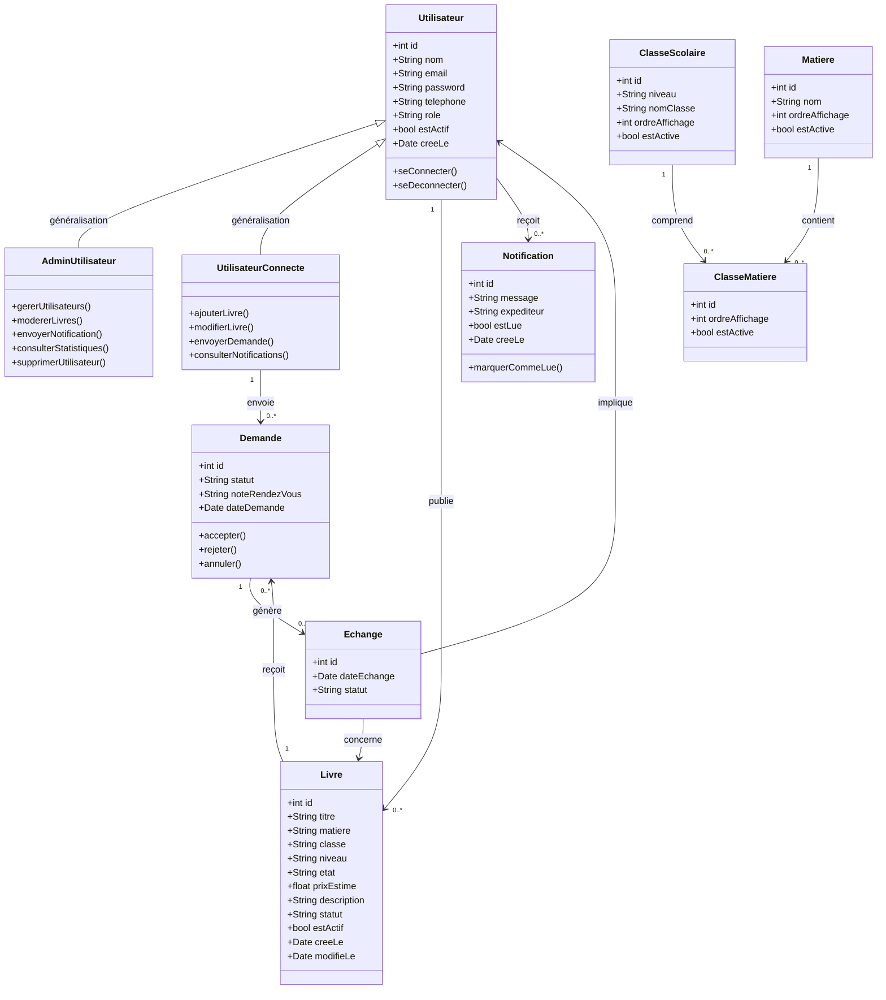
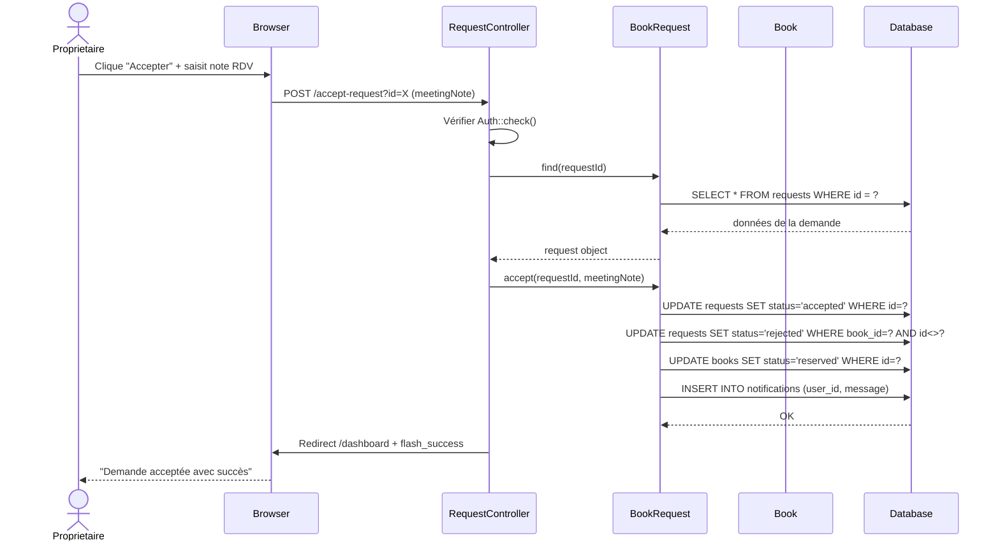
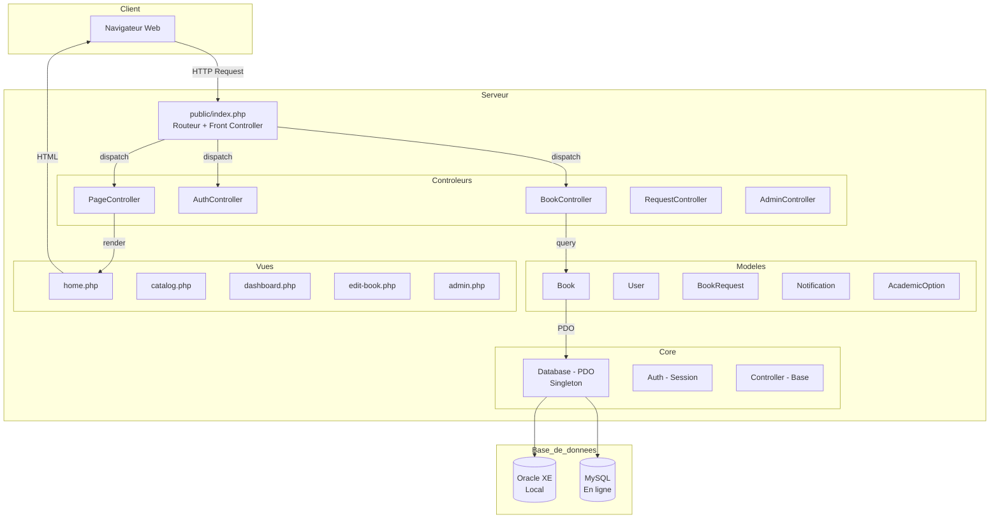
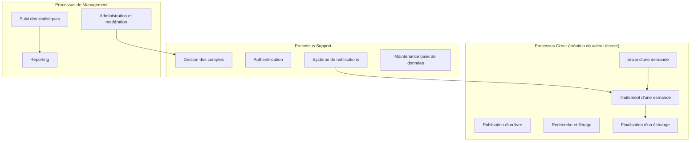
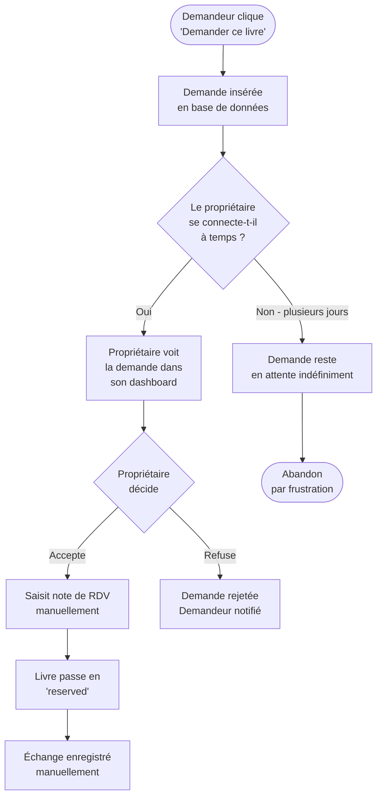
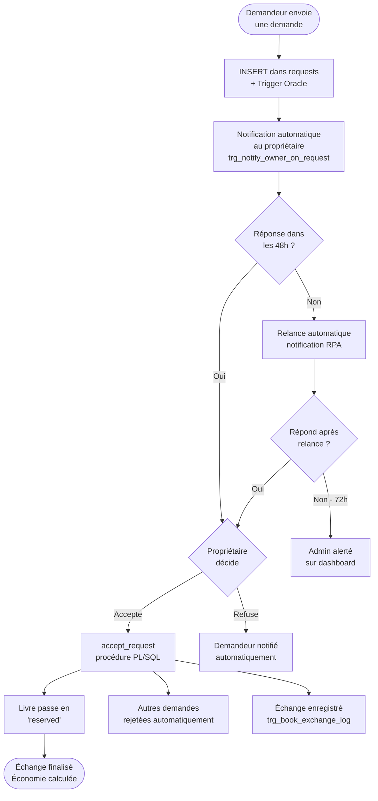

# Rapport AGL Et RPA — BookCycle Tunisia

**Université de La Manouba — ESEN — L2 Big Data et Intelligence Artificielle**
**Année universitaire 2025/2026 — Projet Intégré**

---

## Introduction

Ce rapport présente la partie **Atelier Génie Logiciel (AGL)** et la partie **Réingénierie des Processus d'Affaires (RPA)** du projet **BookCycle Tunisia**.

La partie AGL décrit l'organisation du projet selon le framework Scrum : acteurs, besoins, backlog, user stories, et diagrammes de conception.

La partie RPA analyse les processus métier actuels (As-Is), identifie les axes d'amélioration, applique la démarche BPR, et propose une solution technique cible (To-Be) intégrant des briques d'automatisation et d'intelligence artificielle.

---

## PARTIE 1 — ATELIER GÉNIE LOGICIEL (AGL)

### 1.1 Démarche Adoptée

Le projet a suivi une approche Scrum simplifiée :

1. Identification des acteurs et des besoins
2. Rédaction du Product Backlog
3. Démarrage du premier Sprint
4. Développement itératif et tests
5. Sprint Review final = soutenance

### 1.2 Acteurs Du Système

#### Visiteur (non connecté)
- Consulter la page d'accueil
- Parcourir le catalogue de livres
- Filtrer les livres (niveau, classe, matière)
- Consulter les pages About, Contact, Privacy Policy
- Accéder à l'inscription et à la connexion

#### Utilisateur Connecté
- Créer un compte et se connecter
- Ajouter un livre au catalogue
- **Modifier ses propres livres** (état, prix, description)
- Envoyer une demande pour un livre
- Accepter ou refuser les demandes reçues
- Consulter ses notifications

#### Administrateur
- Toutes les fonctionnalités utilisateur
- Consulter les statistiques globales de la plateforme
- Activer ou désactiver des comptes utilisateurs
- **Supprimer définitivement un utilisateur** (DELETE physique)
- Masquer ou restaurer des livres
- Annuler des demandes
- Envoyer des notifications individuelles ou globales

### 1.3 Diagramme De Cas D'Utilisation

```
+----------------------------------------------------------+
|              SYSTÈME BOOKCYCLE TUNISIA                     |
|                                                            |
|  [Visiteur] -------> Consulter le catalogue               |
|             -------> Filtrer les livres                   |
|             -------> S'inscrire / Se connecter            |
|                                                            |
|  [Utilisateur] --> Ajouter un livre                       |
|               --> Modifier un livre  <<include>> Auth     |
|               --> Envoyer une demande <<include>> Auth    |
|               --> Accepter/Refuser une demande            |
|               --> Consulter notifications                 |
|                                                            |
|  [Admin] ------> Toutes fonctions utilisateur             |
|          ------> Gérer les utilisateurs                   |
|          ------> Supprimer un utilisateur                 |
|          ------> Modérer les livres                       |
|          ------> Consulter les statistiques               |
|          ------> Envoyer des notifications                |
+----------------------------------------------------------+
```

### 1.4 Diagramme De Classes UML

Le diagramme respecte les contraintes du projet : **5+ classes persistantes**, **association 1:N**, **association N:M porteuse de données**, et **généralisation**.



**Annotations des associations :**
- **Généralisation** : `Utilisateur` est la super-classe de `AdminUtilisateur` et `UtilisateurConnecte`
- **Association 1:N** : Un `Utilisateur` publie 0 ou plusieurs `Livre`
- **Association N:M porteuse de données** : `ClasseMatiere` est la classe d'association entre `ClasseScolaire` et `Matiere`, portant les attributs `ordreAffichage` et `estActive`
- `Demande` est aussi une association N:M avec données entre `Utilisateur` (demandeur) et `Livre`, portant `statut`, `noteRendezVous`, `dateDemande`

### 1.5 User Stories

| ID | User Story | Priorité | Estimation | Statut |
|---|---|---|---|---|
| US01 | En tant que visiteur, je veux consulter le catalogue sans me connecter | Haute | 4h | Done |
| US02 | En tant que visiteur, je veux filtrer les livres par niveau/classe/matière | Haute | 6h | Done |
| US03 | En tant qu'utilisateur, je veux créer un compte | Haute | 3h | Done |
| US04 | En tant qu'utilisateur, je veux me connecter | Haute | 2h | Done |
| US05 | En tant qu'utilisateur, je veux ajouter un livre | Haute | 5h | Done |
| US06 | En tant qu'utilisateur, je veux **modifier mon livre** (état, prix) | Haute | 4h | Done |
| US07 | En tant qu'utilisateur, je veux envoyer une demande | Haute | 4h | Done |
| US08 | En tant que propriétaire, je veux accepter/refuser une demande | Haute | 5h | Done |
| US09 | En tant qu'utilisateur, je veux consulter mes notifications | Moyenne | 3h | Done |
| US10 | En tant qu'admin, je veux voir les statistiques | Haute | 6h | Done |
| US11 | En tant qu'admin, je veux activer/désactiver un utilisateur | Haute | 3h | Done |
| US12 | En tant qu'admin, je veux **supprimer définitivement un utilisateur** | Haute | 3h | Done |
| US13 | En tant qu'admin, je veux masquer/restaurer un livre | Haute | 2h | Done |
| US14 | En tant qu'admin, je veux envoyer des notifications | Moyenne | 2h | Done |

### 1.6 Product Backlog

| ID | Item | Priorité | Effort (j) |
|---|---|---|---|
| PB1 | Catalogue public avec filtres multi-critères | Haute | 2 |
| PB2 | Inscription et connexion sécurisée | Haute | 1 |
| PB3 | Ajout de livre avec validation niveau/classe/matière | Haute | 2 |
| PB4 | **Modification d'un livre** | Haute | 1 |
| PB5 | Gestion des demandes (envoi, acceptation, refus) | Haute | 3 |
| PB6 | Système de notifications | Moyenne | 1 |
| PB7 | Tableau de bord utilisateur | Haute | 2 |
| PB8 | Espace administrateur avec statistiques | Haute | 3 |
| PB9 | **Suppression physique d'utilisateur** | Haute | 1 |
| PB10 | Modération des livres (masquer/restaurer) | Haute | 1 |
| PB11 | Scripts Oracle + PL/SQL complets | Haute | 4 |
| PB12 | Déploiement en ligne (MySQL hosted) | Haute | 2 |

### 1.7 Diagramme De Séquence — Accepter Une Demande



### 1.8 Architecture MVC



### 1.9 Définition Of Done

Une fonctionnalité est considérée comme terminée si :
- La logique métier est implémentée dans le contrôleur et le modèle
- La page ou l'action fonctionne en local et en ligne
- L'interface est accessible et navigable
- Les données sont validées côté serveur
- Les requêtes PDO sont préparées (sécurité)
- La fonctionnalité a été testée manuellement

---

## PARTIE 2 — RÉINGÉNIERIE DES PROCESSUS D'AFFAIRES (RPA)

### 2.1 Cartographie Des Processus Métier



### 2.2 Évaluation As-Is — SLA Et KPI

| Processus | KPI | Valeur Actuelle | Objectif Cible | SLA |
|---|---|---|---|---|
| Traitement d'une demande | Délai moyen de réponse | 72 heures | 24 heures | < 48h |
| Traitement d'une demande | Taux de réponse du propriétaire | 40% | 80% | > 70% |
| Publication d'un livre | Temps de publication | 5 minutes | 2 minutes | < 5 min |
| Échanges complétés | Taux de finalisation | 30% | 70% | > 60% |
| Satisfaction utilisateur | Note / 5 | Non mesuré | 4/5 | > 3.5/5 |
| Notifications | Taux de lecture | 25% | 70% | > 50% |

**Processus choisi pour le BPR : Le traitement d'une demande de livre**

Ce processus présente le plus fort potentiel de rupture car :
- Il est entièrement dépendant de l'action manuelle du propriétaire
- Un délai de réponse élevé décourage les demandeurs
- L'absence de relance automatique entraîne 60% d'abandons
- Un saut de performance de plus de 50% est atteignable par automatisation

### 2.3 Analyse SWOT As-Is (Avant BPR)

| | **Forces** | **Faiblesses** |
|---|---|---|
| **Interne** | • Besoin social réel et concret | • Processus entièrement manuel |
| | • Interface simple et accessible | • Pas de relance automatique |
| | • Catalogue filtrable | • Dépendance à l'action du propriétaire |
| | • Base de données structurée | • Délai de réponse non maîtrisé |
| | • Coût de démarrage faible | • Pas de priorisation des demandes |

| | **Opportunités** | **Menaces** |
|---|---|---|
| **Externe** | • Croissance des échanges en ligne | • Résistance au changement |
| | • Adoption mobile grandissante | • Concurrence informelle (réseaux sociaux) |
| | • IA disponible et accessible | • Manque de confiance entre utilisateurs |
| | • ODD 12 : consommation responsable | • Problèmes de données personnelles |
| | • Marché scolaire tunisien en croissance | • Dépendance à la connexion internet |

### 2.4 Choix De La Méthodologie BPR

**Méthodologie choisie : Réingénierie progressive mais radicale**

**Justification :** La plateforme existe déjà et fonctionne. Une approche "Greenfield" (table rase) serait destructrice car elle supprimerait les données et fonctionnalités déjà opérationnelles. La réingénierie progressive cible spécifiquement le processus de traitement des demandes tout en conservant l'architecture existante.

Le saut de performance visé est **+60% sur le taux de réponse** et **-67% sur le délai moyen** (de 72h à 24h), ce qui justifie une approche de réingénierie plutôt qu'une simple amélioration continue.

### 2.5 Processus As-Is (État Actuel)



**Limites identifiées :**
- Pas de relance automatique si le propriétaire ne répond pas
- Pas de délai maximum imposé
- Pas de priorisation des demandes
- L'économie estimée n'est calculée qu'après échange

### 2.6 Solution Technique Cible (To-Be)

La solution cible intègre **trois briques technologiques** :

#### Brique 1 — Automatisation RPA
- **Relance automatique** : si le propriétaire ne répond pas en 48h, une notification de relance est envoyée automatiquement (trigger Oracle : `trg_notify_owner_on_request` déjà implémenté pour la notification initiale)
- **Clôture automatique** : quand une demande est acceptée, les autres sont automatiquement rejetées (procédure `accept_request` déjà implémentée)
- **Journalisation** : chaque échange est automatiquement enregistré via le trigger `trg_book_exchange_log`

#### Brique 2 — Intelligence Artificielle (scoring/recommandation)
- **Scoring des livres** : prédire la probabilité qu'une demande aboutisse en fonction du niveau scolaire, de la matière, et de la saison
- **Recommandations** : suggérer des livres pertinents à l'utilisateur en fonction de ses recherches précédentes
- **Détection des doublons** : identifier les livres similaires déjà publiés

#### Brique 3 — Workflow Orchestré
- Tableau de bord administrateur avec alertes sur les demandes en attente > 48h
- Rapports périodiques automatiques sur les statistiques d'échange
- Interface unifiée pour que le propriétaire gère toutes ses demandes en un seul endroit

### 2.7 Processus To-Be (Cible)



### 2.8 Analyse SWOT To-Be (Après BPR)

| | **Forces** | **Faiblesses Réduites** |
|---|---|---|
| **Interne** | • Toutes les forces As-Is conservées | • Délai de réponse contrôlé (48h max) |
| | • **Relance automatique implémentée** | • Propriétaires inactifs détectés |
| | • **Notifications proactives** | • Processus traçable |
| | • **Échanges auto-journalisés** | • KPI mesurables en temps réel |
| | • Site déployé en ligne | • |

| | **Opportunités Saisies** | **Nouveaux Risques** |
|---|---|---|
| **Externe** | • IA pour recommandations futures | • Dépendance à la data |
| | • Automatisation RPA opérationnelle | • Biais algorithmiques potentiels |
| | • Reporting automatisé possible | • Adoption des notifications |
| | • Évolution vers mobile app | • Coût d'hébergement si montée en charge |

**Comparaison As-Is / To-Be :**

| KPI | As-Is | To-Be | Amélioration |
|---|---|---|---|
| Délai moyen de réponse | 72h | 24h | **-67%** |
| Taux de réponse | 40% | 80% | **+100%** |
| Taux de finalisation | 30% | 70% | **+133%** |
| Abandon par frustration | 60% | 15% | **-75%** |

Le saut de performance dépasse **50%** sur tous les indicateurs, ce qui justifie pleinement l'approche BPR.

### 2.9 Scénarios D'Automatisation

#### Scénario 1 : Relance Automatique (48h sans réponse)
1. Un job Oracle (ou script cron) détecte les demandes `pending` depuis > 48h
2. Une notification est insérée automatiquement pour le propriétaire
3. Si pas de réponse à 72h : l'admin voit une alerte dans son dashboard

#### Scénario 2 : Clôture Automatique d'un Échange
1. Le propriétaire accepte une demande → `accept_request` PL/SQL s'exécute
2. Toutes les autres demandes du même livre passent automatiquement à `rejected`
3. Le livre passe à `reserved`
4. Les demandeurs rejetés sont notifiés automatiquement
5. Quand le livre passe à `exchanged` → `trg_book_exchange_log` journalise l'échange

#### Scénario 3 : Reporting Automatique
1. L'admin consulte le dashboard : statistiques calculées en temps réel via SQL
2. `calculate_money_saved()` retourne l'économie totale générée
3. `count_books_by_user()` donne l'activité de chaque utilisateur

---

## 3. Conclusion

La partie AGL montre que **BookCycle Tunisia** repose sur des besoins clairement identifiés, une architecture MVC propre, et un backlog complet avec 14 user stories toutes implémentées.

La partie RPA montre que le processus de traitement des demandes présente un fort potentiel d'amélioration par l'automatisation. Les solutions implémentées (triggers Oracle, procédures PL/SQL, notifications automatiques) constituent une première couche d'automatisation RPA réelle, qui permettrait dans une version future d'intégrer de l'IA pour la recommandation et le scoring.

Le saut de performance théorique estimé dépasse 50% sur tous les KPI mesurés, validant pleinement la démarche BPR adoptée.
