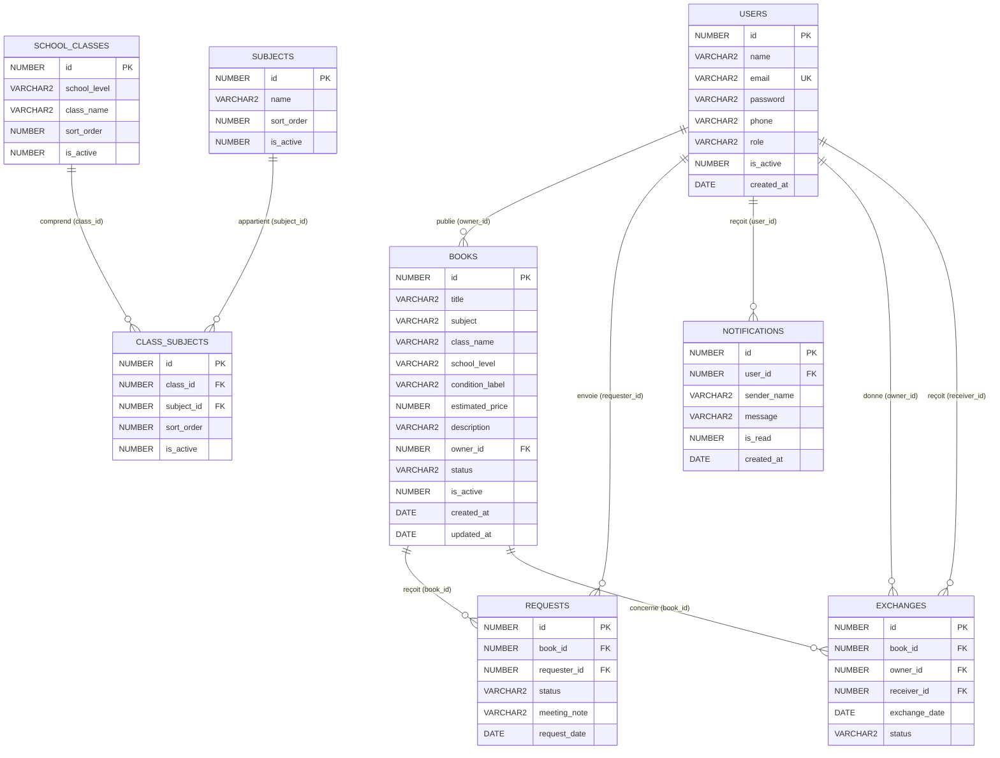

# Rapport SGBD — BookCycle Tunisia

**Université de La Manouba — ESEN — L2 Big Data et Intelligence Artificielle**
**Année universitaire 2025/2026 — Projet Intégré**

---

## Introduction

La partie SGBD du projet **BookCycle Tunisia** a pour objectif de concevoir et d'implémenter une base de données Oracle XE capable de gérer les utilisateurs, les livres, les demandes, les échanges et les notifications de la plateforme.

Le projet exploite pleinement les capacités d'Oracle :
- **SQL** pour la définition et la manipulation des données (DDL + DML)
- **PL/SQL** pour les traitements métier avancés (procédures, fonctions, curseurs, triggers)
- **Objets Oracle** : séquences, vues, index, contraintes d'intégrité

---

## 1. Choix Du SGBD

| Critère | Oracle XE (local) | MySQL (hébergement) |
|---|---|---|
| Environnement | Soutenance locale | Production en ligne |
| URL | localhost:8000 | https://bookcycle-tunisia.page.gd |
| Connexion PHP | PDO_OCI | PDO_MYSQL |
| PL/SQL | Complet | Non applicable |
| Avantages | Séquences, triggers, procédures, fonctions, curseurs, packages | Gratuit, hébergeable |

Oracle XE est le SGBD principal pour les scripts et la soutenance technique. Il permet d'exploiter toutes les fonctionnalités PL/SQL exigées par le cours.

---

## 2. Schéma Relationnel — Diagramme Entité-Relation



---

## 3. Description Des Tables

### Table `USERS`
Stocke tous les comptes utilisateurs (administrateurs et utilisateurs normaux).

| Colonne | Type | Contrainte | Description |
|---|---|---|---|
| id | NUMBER | PK | Généré par `seq_users` via trigger |
| name | VARCHAR2(120) | NOT NULL | Nom complet |
| email | VARCHAR2(160) | UNIQUE, NOT NULL | Adresse email unique |
| password | VARCHAR2(255) | NOT NULL | Mot de passe haché (PHP `password_hash`) |
| phone | VARCHAR2(30) | NOT NULL | Numéro de téléphone |
| role | VARCHAR2(20) | CHECK (`admin`,`user`) | Rôle dans le système |
| is_active | NUMBER(1) | CHECK (0,1) | 1=actif, 0=désactivé |
| created_at | DATE | DEFAULT SYSDATE | Date d'inscription |

### Table `BOOKS`
Catalogue des livres publiés par les utilisateurs.

| Colonne | Type | Contrainte | Description |
|---|---|---|---|
| id | NUMBER | PK | Généré par séquence |
| title | VARCHAR2(180) | NOT NULL | Titre auto-généré (matière + classe + niveau) |
| subject | VARCHAR2(120) | NOT NULL | Matière scolaire |
| class_name | VARCHAR2(60) | NOT NULL | Classe (ex: 7ème, 1ère) |
| school_level | VARCHAR2(40) | NOT NULL | Niveau (Primaire/Collège/Lycée) |
| condition_label | VARCHAR2(40) | NOT NULL | État du livre (Neuf/Bon/Usagé) |
| estimated_price | NUMBER(10,2) | DEFAULT 0 | Prix estimé en DT |
| description | VARCHAR2(1000) | - | Description optionnelle |
| owner_id | NUMBER | FK → users.id | Propriétaire du livre |
| status | VARCHAR2(20) | CHECK | available/reserved/exchanged |
| is_active | NUMBER(1) | CHECK (0,1) | Visibilité publique |
| created_at / updated_at | DATE | DEFAULT SYSDATE | Horodatages |

### Table `REQUESTS`
Association N:M avec données entre utilisateurs (demandeurs) et livres.

| Colonne | Type | Contrainte | Description |
|---|---|---|---|
| id | NUMBER | PK | Généré par séquence |
| book_id | NUMBER | FK → books.id | Livre demandé |
| requester_id | NUMBER | FK → users.id | Utilisateur demandeur |
| status | VARCHAR2(20) | CHECK | pending/accepted/rejected |
| meeting_note | VARCHAR2(1000) | - | Note de rendez-vous (remplie à l'acceptation) |
| request_date | DATE | DEFAULT SYSDATE | Date de la demande |

### Table `EXCHANGES`
Enregistre les échanges finalisés (insérée automatiquement par trigger).

| Colonne | Type | Contrainte | Description |
|---|---|---|---|
| book_id | NUMBER | FK → books.id | Livre échangé |
| owner_id | NUMBER | FK → users.id | Donneur |
| receiver_id | NUMBER | FK → users.id | Receveur |
| exchange_date | DATE | DEFAULT SYSDATE | Date de l'échange |
| status | VARCHAR2(20) | - | completed |

### Table `NOTIFICATIONS`
Messages envoyés aux utilisateurs par le système ou l'administrateur.

### Tables de Référence (`SUBJECTS`, `SCHOOL_CLASSES`, `CLASS_SUBJECTS`)
Ces trois tables stockent le référentiel académique (matières, classes, correspondances).
`CLASS_SUBJECTS` est une table d'association porteuse de données entre `SCHOOL_CLASSES` et `SUBJECTS`.

---

## 4. Contraintes D'Intégrité

| Type | Contrainte | Description |
|---|---|---|
| CHECK | `role IN ('admin','user')` | Seuls deux rôles autorisés |
| CHECK | `books.status IN ('available','reserved','exchanged')` | Cycle de vie du livre |
| CHECK | `requests.status IN ('pending','accepted','rejected')` | États d'une demande |
| CHECK | `is_active IN (0,1)` | Flag booléen sur plusieurs tables |
| UNIQUE | `users.email` | Email unique par utilisateur |
| UNIQUE | `(class_id, subject_id)` dans `class_subjects` | Pas de doublon |
| FK | `books.owner_id → users.id` | Livre appartient à un utilisateur |
| FK | `requests.book_id → books.id` | Demande sur un livre existant |
| FK | `requests.requester_id → users.id` | Demandeur existant |
| FK | `notifications.user_id → users.id` | Notification pour un utilisateur |

---

## 5. Séquences Et Triggers D'Auto-Incrément

Oracle XE ne dispose pas de `AUTO_INCREMENT`. Chaque table utilise une séquence + un trigger `BEFORE INSERT` :

| Séquence | Trigger | Table |
|---|---|---|
| seq_users | trg_users_pk | users |
| seq_subjects | trg_subjects_pk | subjects |
| seq_school_classes | trg_school_classes_pk | school_classes |
| seq_class_subjects | trg_class_subjects_pk | class_subjects |
| seq_books | trg_books_pk | books |
| seq_requests | trg_requests_pk | requests |
| seq_exchanges | trg_exchanges_pk | exchanges |
| seq_notifications | trg_notifications_pk | notifications |

**Exemple de trigger PK :**
```sql
CREATE OR REPLACE TRIGGER trg_books_pk
BEFORE INSERT ON books
FOR EACH ROW
BEGIN
    IF :NEW.id IS NULL THEN
        SELECT seq_books.NEXTVAL INTO :NEW.id FROM dual;
    END IF;
END;
```

---

## 6. Index

| Index | Table | Colonnes | Utilité |
|---|---|---|---|
| idx_subjects_active | subjects | is_active, sort_order | Filtres de matières |
| idx_school_classes_level | school_classes | school_level, sort_order | Filtres de classes |
| idx_class_subjects_class | class_subjects | class_id, sort_order | Jointures |
| idx_class_subjects_subject | class_subjects | subject_id, sort_order | Jointures |
| idx_books_owner | books | owner_id | Livres d'un utilisateur |
| idx_books_subject | books | subject | Filtres catalogue |
| idx_books_level | books | school_level | Filtres catalogue |
| idx_requests_book | requests | book_id | Demandes d'un livre |
| idx_requests_requester | requests | requester_id | Demandes d'un utilisateur |
| idx_notifications_user | notifications | user_id | Notifications d'un user |

---

## 7. Vue De Reporting

```sql
CREATE OR REPLACE VIEW v_book_overview AS
SELECT
    b.id          AS book_id,
    b.title,
    b.subject,
    b.class_name,
    b.school_level,
    b.condition_label,
    b.estimated_price,
    b.status,
    u.name        AS owner_name,
    u.email       AS owner_email,
    b.created_at
FROM books b
JOIN users u ON u.id = b.owner_id;
```

Cette vue combine les informations des livres et de leurs propriétaires pour les rapports et le catalogue public.

---

## 8. Scripts Oracle

| Script | Rôle | Utilisateur |
|---|---|---|
| `01_users_privileges.sql` | Création des utilisateurs Oracle et privileges | SYSTEM |
| `02_schema.sql` | Tables, séquences, triggers PK, index, vue | BOOKCYCLE_APP |
| `03_sample_data.sql` | Données de démonstration | BOOKCYCLE_APP |
| `04_queries.sql` | 33 types de requêtes SQL commentées | BOOKCYCLE_APP |
| `05_plsql_objects.sql` | Procédures, fonctions, curseurs | BOOKCYCLE_APP |
| `06_triggers.sql` | 5 triggers métier | BOOKCYCLE_APP |

**Ordre d'exécution :**
1. `01_users_privileges.sql` (connecté en SYSTEM)
2. `02_schema.sql` (connecté en BOOKCYCLE_APP)
3. `03_sample_data.sql`
4. `05_plsql_objects.sql`
5. `06_triggers.sql`
6. `04_queries.sql` (démonstration soutenance)

---

## 9. Requêtes SQL Couvertes (04_queries.sql)

| # | Type de requête | Description |
|---|---|---|
| 1 | SELECT simple | Tous les utilisateurs |
| 2 | Projection | Colonnes sélectionnées |
| 3–4 | WHERE | Conditions simples et multiples |
| 5 | ORDER BY | Tri des livres |
| 6–7 | INNER JOIN | Jointures multi-tables |
| 8–9 | GROUP BY / HAVING | Agrégations avec filtre |
| 10–11 | Sous-requête IN | Utilisateurs ayant publié |
| 12 | Vue | `v_book_overview` |
| 13–16 | UPDATE / DELETE | Modification et suppression logique |
| 17–18 | Rapports statistiques | Par statut, valeur |
| 19–23 | Dictionnaire de données | `user_indexes`, `user_triggers`, `user_objects` |
| **24** | **INSERT** | Insertion d'un utilisateur |
| **25** | **DISTINCT** | Niveaux scolaires sans doublons |
| **26** | **LEFT JOIN** | Livres avec nombre de demandes |
| **27** | **AVG / MIN / MAX / SUM** | Statistiques sur les prix |
| **28** | **BETWEEN** | Prix dans un intervalle |
| **29** | **IN liste** | Filtrage par liste de valeurs |
| **30** | **EXISTS** | Sous-requête corrélée |
| **31** | **UNION** | Combinaison de résultats |
| **32** | **MINUS** | Différence de résultats |
| **33** | **TO_CHAR / MONTHS_BETWEEN** | Fonctions de date Oracle |

---

## 10. Objets PL/SQL (05_plsql_objects.sql)

### Procédures Stockées

#### `add_notification(p_user_id, p_message)`
```sql
CREATE OR REPLACE PROCEDURE add_notification (
    p_user_id IN users.id%TYPE,
    p_message IN notifications.message%TYPE
) IS
BEGIN
    INSERT INTO notifications (user_id, message, is_read, created_at)
    VALUES (p_user_id, p_message, 0, SYSDATE);
END;
```
**Rôle :** Insérer une notification pour un utilisateur. Utilise `%TYPE` pour hériter du type Oracle de la colonne.

#### `accept_request(p_request_id, p_meeting_note)`
**Rôle :** Accepter une demande de façon atomique :
1. Passer la demande à `accepted`
2. Rejeter toutes les autres demandes du même livre
3. Passer le livre à `reserved`
4. Notifier le demandeur
Gère l'exception `NO_DATA_FOUND`.

### Fonctions Stockées

#### `count_books_by_user(p_user_id)` → NUMBER
Compte les livres actifs d'un utilisateur. Retourne un entier.

#### `calculate_money_saved()` → NUMBER
Calcule la somme des prix estimés des livres échangés.
Utilise `NVL(SUM(...), 0)` pour retourner 0 si aucun échange.

### Curseurs

#### Curseur Implicite (SQL%ROWCOUNT)
```sql
BEGIN
    UPDATE notifications SET is_read = 1 WHERE user_id = 2 AND is_read = 0;
    DBMS_OUTPUT.PUT_LINE('Notifications lues : ' || SQL%ROWCOUNT);
    ROLLBACK;
END;
```
`SQL%ROWCOUNT` est l'attribut de curseur implicite qui indique le nombre de lignes affectées.

#### Curseur Explicite (OPEN/FETCH/CLOSE)
```sql
DECLARE
    CURSOR c_available_books IS
        SELECT id, title, subject FROM books WHERE status = 'available';
    v_book c_available_books%ROWTYPE;  -- %ROWTYPE hérite la structure
BEGIN
    OPEN c_available_books;
    LOOP
        FETCH c_available_books INTO v_book;
        EXIT WHEN c_available_books%NOTFOUND;  -- attribut %NOTFOUND
        DBMS_OUTPUT.PUT_LINE('Livre : ' || v_book.title);
    END LOOP;
    CLOSE c_available_books;
END;
```

---

## 11. Triggers Métier (06_triggers.sql)

| Trigger | Type | Événement | Rôle |
|---|---|---|---|
| `trg_books_updated_at` | BEFORE UPDATE, **ligne** | books | Met à jour `updated_at` automatiquement |
| `trg_book_exchange_log` | AFTER UPDATE OF status, **ligne** | books | Journalise l'échange quand statut = `exchanged` |
| `trg_notify_owner_on_request` | AFTER INSERT, **ligne** | requests | Notifie le propriétaire à chaque nouvelle demande |
| `trg_validate_user_email` | BEFORE INSERT, **ligne** | users | Valide que l'email contient `@` via `RAISE_APPLICATION_ERROR` |
| `trg_books_audit_statement` | AFTER INSERT/UPDATE/DELETE, **instruction** | books | Trigger de niveau instruction (sans `FOR EACH ROW`) |

### Différence Trigger Ligne vs Trigger Instruction

```
BEFORE UPDATE ON books FOR EACH ROW    → s'exécute 1 fois par ligne modifiée
AFTER INSERT OR UPDATE OR DELETE ON books  → s'exécute 1 fois par ordre SQL entier
(sans FOR EACH ROW)                        (même si 100 lignes sont modifiées)
```

Le trigger `trg_books_audit_statement` illustre spécifiquement le trigger de niveau **instruction** : il ne peut pas accéder à `:NEW` ou `:OLD` car il ne traite pas les lignes individuellement.

### Exemple — Trigger Avec Clause WHEN

```sql
CREATE OR REPLACE TRIGGER trg_book_exchange_log
AFTER UPDATE OF status ON books
FOR EACH ROW
WHEN (NEW.status = 'exchanged' AND OLD.status <> 'exchanged')
-- Dans WHEN : NEW et OLD sans deux-points
-- Dans le corps BEGIN...END : :NEW et :OLD avec deux-points
DECLARE
    v_receiver_id requests.requester_id%TYPE;
BEGIN
    SELECT requester_id INTO v_receiver_id
    FROM requests
    WHERE book_id = :NEW.id AND status = 'accepted' AND ROWNUM = 1;

    INSERT INTO exchanges (book_id, owner_id, receiver_id, exchange_date, status)
    VALUES (:NEW.id, :NEW.owner_id, v_receiver_id, SYSDATE, 'completed');
EXCEPTION
    WHEN NO_DATA_FOUND THEN NULL;
END;
```

---

## 12. Utilisateurs Oracle

| Utilisateur | Rôle | Privilèges |
|---|---|---|
| `bookcycle_app` | Propriétaire du schéma | CREATE SESSION, TABLE, VIEW, PROCEDURE, TRIGGER, SEQUENCE, UNLIMITED TABLESPACE |
| `bookcycle_report` | Lecture seule (reporting) | CREATE SESSION, SELECT sur toutes les tables et la vue |

**Vérification des utilisateurs :**
```sql
SELECT username, account_status, created FROM dba_users
WHERE username IN ('BOOKCYCLE_APP', 'BOOKCYCLE_REPORT');
```

---

## 13. Annexe — Tous Les Objets Du Schéma

Requête de vérification (à exécuter lors de la soutenance) :

```sql
-- Tous les objets du schéma
SELECT object_name, object_type, status
FROM user_objects
ORDER BY object_type, object_name;
```

**Résultat attendu :**

| Type | Objets |
|---|---|
| TABLE (8) | users, subjects, school_classes, class_subjects, books, requests, exchanges, notifications |
| VIEW (1) | v_book_overview |
| SEQUENCE (8) | seq_users, seq_subjects, seq_school_classes, seq_class_subjects, seq_books, seq_requests, seq_exchanges, seq_notifications |
| TRIGGER (18) | 8 triggers PK + trg_books_updated_at, trg_book_exchange_log, trg_notify_owner_on_request, trg_validate_user_email, trg_books_audit_statement |
| PROCEDURE (2) | add_notification, accept_request |
| FUNCTION (2) | count_books_by_user, calculate_money_saved |
| INDEX (10) | idx_subjects_active, idx_school_classes_level, idx_class_subjects_class, idx_class_subjects_subject, idx_books_owner, idx_books_subject, idx_books_level, idx_requests_book, idx_requests_requester, idx_notifications_user |

---

## Conclusion

La partie SGBD de **BookCycle Tunisia** fournit une base solide, complète et conforme aux exigences du cours. Le schéma Oracle couvre 8 tables avec contraintes d'intégrité, 8 séquences + 8 triggers PK, 10 index, une vue de reporting, 2 procédures, 2 fonctions, 5 triggers métier (dont 1 de niveau instruction), des curseurs implicites et explicites, et 33 types de requêtes SQL.

Toutes les fonctionnalités Oracle spécifiques sont exploitées : `%TYPE`, `%ROWTYPE`, `SQL%ROWCOUNT`, `DBMS_OUTPUT.PUT_LINE`, `RAISE_APPLICATION_ERROR`, `NO_DATA_FOUND`, `NVL`, `TO_CHAR`, `SYSDATE`, `ROWNUM`.
